class: title-slide, middle

<style type="text/css">
  .title-slide {
    background-image: url('assets/img/Coding.png');
    background-color: #23373B;
    background-size: contain;
    border: 0px;
    background-position: 600px 0;
    line-height: 1;
  }
</style>

# Bienvenue à l'atelier 1

<hr width="65%" align="left" size="0.3" color="orange"></hr>

### Introduction à la programmation scientifique et au langage R

<hr width="65%" align="left" size="0.3" color="orange" style="margin-bottom:40px;" alt="@Martin Sanchez"></hr>

.instructors[
  ***ALÉA R*** - Antoine Bergeron
]

</img>

---

# Rappel

Avez-vous vu le plan des ateliers?

Matériel du cours à l'adresse :
https://github.com/AntoineBergeron/Ateliers_ALEA

---
class: inverse, middle, center

# L'idée derrière l'ordinateur!
<hr width="65%" size="0.3" color="orange" style="margin-top:-20px;"></hr>

---

# Introduction

<div style='text-align:center;'>
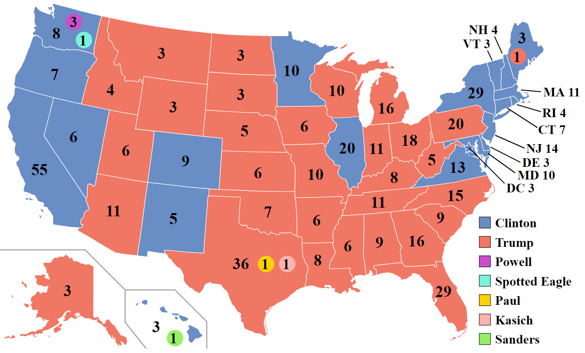</img> 
</div>

<div style='text-align:center;'>
Résultats de l'élection présidentielle américaine de 2016
</div>

---

# Le type de données

```{r}
can <- read.table(file = './donnees/Canadiens.txt', sep="\t", header = TRUE)
head(can)
```

---

# Le type de données 

```{r}
parties <- read.table(file = './donnees/parties.txt', sep="\t", header = TRUE)
head(parties)
```

---

# Exemple 1

Ouvrir le fichier [parties](./donnees/parties.xlsx) avec Excel et trouver le nombre de buts marqués par le Canadiens de Montréal en fonction du résultat de la partie.

---

# Exemple 1: solution sur R

```{r}
parties <- read.table(file = './donnees/parties.txt', sep="\t", header = TRUE)
ButsResult <- table(parties$Buts.pour,parties$Resultat)
head(ButsResult)
```

```{r, echo=FALSE}
write.table(ButsResult, file="./donnees/ButsResult.txt",sep="\t",quote=TRUE)
```
---

# Exemple 2

Ouvrir le fichier [ButsResult](./donnees/ButsResult.xlsx) avec Excel et calculer la corrélation entre les différents résultats d'une partie.

Indice: sur Excel, la fonction pour calculer une corrélation est:

```bash
=COEFFICIENT.CORRELATION(données_1; données_2)
```

---

# Exemple 2: solution sur R

```{r,eval=FALSE}
ButsResult <- read.table(file = './donnees/ButsResult.txt', header = TRUE, sep= "\t")
cor(ButsResult)
```

```{r,eval=TRUE,echo=FALSE}
ButsResult <- read.table(file = './donnees/ButsResult.txt', header = TRUE, sep= "\t")
round(cor(ButsResult),6)
```

---

# Exercice 2: visualisation sur R

```{r,  fig.width= 6, fig.height= 6, fig.align='center'}
plot(ButsResult)
```

---
class: inverse, middle, center

# La place de la programmation dans le monde
<hr width="65%" size="0.3" color="orange" style="margin-top:-20px;"></hr>


---

# Hier

<div style='text-align:center;'>
</img>
</div>

---

# Aujourd'hui

<div style='text-align:center;'>
</img>
</div>


---

# Et demain...

Google Duplex

<a href="http://www.youtube.com/watch?feature=player_embedded&v=yDI5oVn0RgM
" target="_blank"></a>

---

# Progression de la puissance de calcul

<div style='text-align:center;'>
  </img>
</div>

<!-- Ces questions sont rendu possible en partie grâce à l'augmentation de la puissance de nos ordinateurs et l'accessibilité aux données -->


---

# Utilisation en recherche au quotidien

La programmation est un outil indispensable au chercheur 2.0, elle permet de réaliser:

- Tâches répétitives et/ou complexes (p. ex. Nettoyage des données, Simulations stochastiques)
- Visualisation et exploration des données
- Analyses statistiques avancées (p. ex. Tests par permutations)

---

# La programmation en recherche

.pull-left[
## Avantages

- Gain de temps
- Limiter les erreurs
- Formaliser les opérations
- Archiver, reproduire et partager
- Tâches intensives (e.g. en génomique)
]


.pull-right[
## Augmentation du volume de données génomiques
</img>
<span style="font-size:small;text-transform:uppercase;text-align:right;">
[Nature 2013](http://www.nature.com/nature/journal/v498/n7453/full/498255a.html)
</span>
]

---

# La programmation en recherche

</img>

<!-- Feuille personnalisé  -->

---

# La programmation en recherche

.pull-left[
## Inconvénients

- L'erreur est avant tout humaine, avant d'être informatique
- La courbe apprentissage peut être difficile
]

.pull-right[
</img>
]

---

## Exemple

Supposons que l'on cherche à calculer:


$$ \dfrac{w \cdot x + y}{z} $$

avec $w = 2$, $x = 6$, $y = 4$ et $z = 4$.

---

## Exemple (suite)

```
w <- 2
x <- 6
y <- 4
z <- 4


Rep1 <- w*x + y / z
Rep2 <- (w*x + y)/z


Rep1 = 13
Rep2 = 4

```
Mais, quelle réponse est la bonne? 


---

class: inverse, middle, center

# Le Pseudo-Code
<hr width="65%" size="0.3" color="orange" style="margin-top:-20px;"></hr>

---

# Le `Pseudo-Code` et ses **algorithmes**


## Définitions

- *En programmation, le `pseudo-code` est une façon de formuler un <b>algorithme</b> sans référence à un langage de programmation en particulier.*

> - *Un <b>algorithme</b> est une suite d'actions réalisées dans un ordre précis par l'ordinateur. C'est une séquence d'étapes dans la résolution d'un problème.*

---

# Le `Pseudo-Code`

## Exemple

```
PROGRAM DEMO
  FOR t IN 1:100
    n_t = n_t + n_t * lambda
    PRINT n_t
    IF n_t < 1
      BREAK
    ELSE
      CONTINUE
    END IF
  END FOR
```

Le programme `DEMO` fait croître une population de taille initiale $n_t$ à un taux $\lambda$ et affiche à l'utilisateur si la population est éteinte $n_t<1$ ou vivante $n_t>1$.

---

# Le `Pseudo-Code`

## Exemple

```
PROGRAM DEMO
  FOR t IN 1:100 <------------- Opération itérative
    n_t = n_t + (n_t * lambda)
    PRINT n_t <---------------- Le programme affiche la valeur à l'écran
    IF n_t < 1 <--------------- Opération décisionnelle
      BREAK <------------------ Le programme arrête son exécution
    ELSE
      CONTINUE <--------------- Le programme continue son exécution
    END IF
  END FOR
```

Le programme `DEMO` fait croitre une population de taille initiale $n_t$ à un taux $\lambda$ et affiche à l'utilisateur si la population est éteinte $n_t<1$ ou vivante $n_t>1$.

**Exemple** : 1000 + (1000 * 0.01) = 1010


---

# Les structures de base d'un algorithme

Il existe 3 familles d'opérations:

1. Les opérations séquentielles
2. Les opérations itératives (`FOR`, `WHILE`)
3. Les opérations décisionnelles (`IF`, `IFELSE`)

---

# Avant-propos

Avant de décrire chacune des opérations d'un algorithme, certaines instructions sont communes:

- `READ`: Le programme lit un fichier
- `WRITE`: Le programme écrit un fichier
- `PRINT`: Le programme écrit un message à l'écran pour l'utilisateur
- `BREAK`: Le programme arrête son exécution
- `CONTINUE`: Le programme continue son exécution

---

# 1. Les opérations séquentielles

## Exemple: Calculer l'aire d'un rectangle

```
PROGRAM AIRE_REC
  READ hauteur
  READ largeur
  WRITE hauteur * largeur
```

Chaque opération est effectuée l'une après l'autre dans un **ordre déterminé**.

---

# 2. Les opérations itératives

## Exemple avec `FOR`: Croissance exponentielle

```
PROGRAM DEMO
  FOR t IN 1:100
    n_t = n_t + n_t * lambda
  END FOR
```

La population va croître pendant 100 pas de temps.

---

# 2. Les opérations itératives

## Exemple avec `WHILE`: Croissance avec capacité de support (K)

```
PROGRAM DEMO
  WHILE n_t < K
    n_t = n_t + n_t * lambda
  END WHILE
```

La population va croître pour un pas de temps indéterminé. L'arrêt de l'opération itérative est relié à la capacité de support. Tant que la quantité d'être humain (n_t) ne dépassera pas K (valeur prédéfinie), on continue.

---

# 3. Les opérations décisionnelles

## Exemple avec `IF`: quelques tests sur $\lambda$

```
PROGRAM DEMO
  IF lambda > 0
    PRINT "La population est croissante"
  ELSE lambda < 0
    PRINT "La population est décroissante"
  ENDIF
```


---

# 3. Les opérations décisionnelles

## Exemple avec `IF`: quelques tests sur $\lambda$

```
PROGRAM DEMO
  IF lambda > 0
    PRINT "La population est croissante"
  ELSE lambda < 0
    PRINT "La population est décroissante"
  ENDIF
```

> - Et si le taux de croissance est nul?
---

# 3. Les opérations décisionnelles

## Exemple avec `IF`: quelques tests sur $\lambda$

```
PROGRAM DEMO
  IF lambda > 0
    PRINT "La population est croissante"
  IF ELSE lambda < 0
    PRINT "La population est décroissante"
  ELSE
    PRINT "Absence de croissance"
  ENDIF
```

Avec la clause `IF ELSE`, nous pouvons ajouter tout les cas particuliers qui peuvent survenir: par exemple, notre absence de croissance!

---

# Les types d'objets

Les objets en programmation sont définis en fonction de leur dimensionnalité.

## Dimensionnalité

- **Dimension 0** : Valeur unique (ou scalaire)
- **Dimension 1** : Vecteur
- **Dimension 2** : Matrice
- **Dimension 3** : ...

Bien qu'il n'y ait pas de limite à la dimension d'un objet en programmation,
nous nous limiterons pour les différents ateliers à des objets en deux dimensions.

---

# Dimension 0: Les scalaires

Ces objets ne contiennent qu'une seule information

## Exemple

```
Nom = "Anthony"
Age = 32
Fraise = TRUE
QI = 456457.678
Banque = -7000
Verite = FALSE
```

---

# Dimension 1:  Les vecteurs

Ces objets contiennent une série d'information. Chaque valeur
possède une position dans le vecteur, laquelle peut être accédée.

## Exemple

```
lettre = ["R" "S" "T" "U" "D" "I" "O"]
lettre[3]
# "T"
```

---

# Dimension 2: Les matrices

Ayant deux dimensions, ces objets présentent les données sous forme de tableaux. Ces tableaux sont représentés par des matrices avec un certain nombre de lignes et de colonnes. Pour accéder à une valeur dans une matrice il faut en premier lieu donner la position de la <b>ligne</b> suivit de la position de la <b>colonne</b>.


## Exemple

```
lettreTab = ["A" "B" "C"
             "D" "E" "F"
             "G" "H" "I"]
lettreTab[2, 1]
# "D"
```

---

# Les règles du `pseudo-code`

## À garder en mémoire

1. N'écrivez qu'une seule instruction par ligne de pseudo-code.
2. Écrivez en lettres majuscules le verbe de chaque opération principale.
3. Soyez explicite en nommant les opérations et les variables.
4. Soyez le plus détaillé possible (c.à.d les plus petites étapes possibles)
5. Utilisez des structures de langages de programmation connues (c.à.d `WHILE`, `FOR`, `IF` etc.)
6. Délimitez les étapes en formant des blocs d'instructions par l'utilisation de l'indentation.

<b> Ces règles sont générales, peu importe le langage de programmation utilisé. </b>


---

class: inverse, middle, center

# Les bonnes pratiques en programmation scientifique
<hr width="65%" size="0.3" color="orange" style="margin-top:-20px;"></hr>


---

# Les 10 commandements de la programmation

> <b>1.</b> Tu commenteras ton code pour que d'autres puissent le lire, le comprendre et le partager
---

# Les 10 commandements de la programmation

> <b>1.</b> Tu commenteras ton code pour que d'autres puissent le lire, le comprendre et le partager


\# Avec le symbole "#", il est possible d'écrire des commentaires!

\# Ceci peut s'avérer utile afin de détailler notre code. 

<div style='text-align:center;'>
  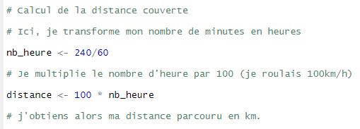</img>
</div>
---

# Les 10 commandements de la programmation

> <b>2.</b> Il faut prendre soin de l'environnement et nettoyer ses déchets
---

# Les 10 commandements de la programmation

> <b>2.</b> Il faut prendre soin de l'environnement et nettoyer ses déchets


Tout comme pour la planète, il est important de garder notre environnement de programmation soigné. L'ajout de commentaire peut aider, mais il ne faut pas non-plus exagérer! De plus, dans un fichier de code (tout comme dans n'importe quel fichier informatique), on ne devrait jamais garder les choses qui ne servent à rien. On doit faire du ménage!

<div style='text-align:center;'>
  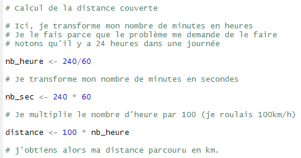</img>
</div>

---

# Les 10 commandements de la programmation

> <b>3.</b> Ton script sera dur à avaler. Mieux vaut le découper
---

# Les 10 commandements de la programmation

> <b>3.</b> Ton script sera dur à avaler. Mieux vaut le découper


Le pseudo-code est souvent très utile pour répondre à ce commandement. Celui-ci agit à titre de résumer et nous permet de mieux séparer les différentes sections nécessaires dans la réalisation de notre script. N'oublions pas que de programmer, c'est avant tout résoudre des problèmes. De plus, si l'histoire nous a bien appris une chose, c'est bien qu'il vaut mieux diviser pour régner.

.pull-left[
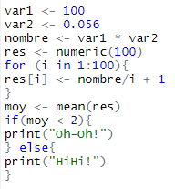</img>
]

.pull-right[
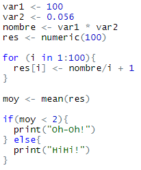</img>
]

---


# Les 10 commandements de la programmation

> <b>4.</b> Plusieurs chiens s'appellent Fido, le tiens tu sauras le nommer
---

# Les 10 commandements de la programmation

> <b>4.</b> Plusieurs chiens s'appellent Fido, le tiens tu sauras le nommer


Lorsqu'on écrit un algorithme, on travaille avec des objets (ou encore des variables).

Il vaut mieux bien nommer ces objets, sans quoi le code devient rapidement illisible et complexe!

```
x = xx + xxx

y = y1 + y2

z = Z_A + Z_B

a = x * y * z
```
---

# Les 10 commandements de la programmation

> <b>5.</b> Des pas de bébés permettent aussi d'avancer
---

# Les 10 commandements de la programmation

> <b>5.</b> Des pas de bébés permettent aussi d'avancer

On ne se cachera pas que programmer, c'est difficile au début. On doit apprendre une nouvelle langue et penser différemment. C'est important d'être fier et satisfait de nos petites victoires! L'important, c'est de garder une mentalité de marathonien: il ne s'agit que de mettre un pied devant l'autre pour atteindre la ligne d'arrivée!
---

# Les 10 commandements de la programmation

> <b>6.</b> Un bon programmeur est paresseux. Les opérations répétées doivent être définies sous forme de fonctions
---


# Les 10 commandements de la programmation

> <b>6.</b> Un bon programmeur est paresseux. Les opérations répétées doivent être définies sous forme de fonctions


Si en programmant, on se rend compte que l'on utilise toujours la même opération, alors mieux vaut la définir sous forme de fonction et appeler la fonction. C'est en quelque sorte une branche du $2^e$ commandement! Un des buts de la programmation, c'est aussi de ne pas avoir à répéter une même tâche encore et encore!

---

# Les 10 commandements de la programmation

> <b>7.</b> La vie est trop courte, ton code sera optimisé
---

# Les 10 commandements de la programmation

> <b>7.</b> La vie est trop courte, ton code sera optimisé


Bien que ce n'est pas la chose la plus importante lorsqu'on apprend à coder, il vient un temps où il est important de faire des algorithmes efficaces. La perte de temps se doit d'être minimale. Qu'il s'agit de sauver 3 millièmes de secondes ou 11 minutes, le fait d'optimiser son code devrait être un réflexe habituel, peu importe la longueur du script.

---

# Les 10 commandements de la programmation

> <b>8.</b> Et un jour tu disparaîtras, alors assure toi que ton code soit reproductible
---

# Les 10 commandements de la programmation

> <b>8.</b> Et un jour tu disparaîtras, alors assure toi que ton code soit reproductible


Certains logiciels permettent de créer des projets plutôt que simplement un script contenant un algorithme. Ceci peut permettre d'éviter certaines erreurs lorsque l'on bouge ou modifie des fichiers.

---

# Les 10 commandements de la programmation

> <b>9.</b> En tout puissant que tu es, le tirage au sort tu pourras répéter
---

# Les 10 commandements de la programmation

> <b>9.</b> En tout puissant que tu es, le tirage au sort tu pourras répéter


Certaines commandes permettent de faire en sorte que notre code donnera toujours le même résultat, et ce, même si on utilise des valeurs aléatoires! Ceci peut être fort utile, voir nécessaire, lorsqu'on construit des modèles complexes.

---

# Les 10 commandements de la programmation

> <b>10.</b> Et dans le passé tu souhaiteras voyager, utilise le contrôle de versions
---

# Les 10 commandements de la programmation

> <b>10.</b> Et dans le passé tu souhaiteras voyager, utilise le contrôle de versions


Quand quelque chose fonctionne, on ne veut surtout pas le briser. C'est pourquoi on a tendance à copier nos fichiers qui contiennent notre code pour éviter de faire des bêtises. Dans ce cas, il est très important de bien identifier ces fichiers (par exemple avec des dates).

---


# Google R Style Rules

- Noms de `fichier`: se termine par .R
- `Identifiants`: variable.nom (ou VariableNom), FonctionNom
- Longueur de `ligne`: maximum 80 caractères
- `Indentation`: deux espaces, pas de tabulations
- `Espacement`: placer des espaces autour des opérateurs binaires
- `Accolades { }`: s'ouvre sur la même ligne, se ferme sur une ligne indépendente (sauf pour `else`)
- `else` : Entourer `else` avec des accolades (`}else{`)
- `Affectation`: utiliser `<-`, pas `=`   (<-)
- `Commentaire`: tous les commentaires sont précédés par `#` et suivit d'un espace
- `Fonction`: doivent avoir une section de commentaires

---

class: inverse, middle, center

# Exercices 
<hr width="65%" size="0.3" color="orange" style="margin-top:-20px;"></hr>

---

# Le `pseudo-code`

## Exercice 1

La caisse dans laquelle je transporte mes oranges a brisé. Ainsi, j'aimerais transférer chacune de mes oranges vers ma nouvelle caisse.

*Notons qu'ici, je n'ai aucune idée sur la quantité d'oranges dans ma caisse. 

.pull-left[
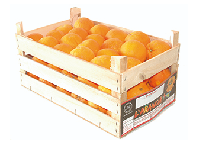</img>
]

.pull-right[
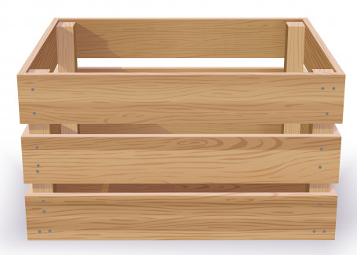</img>
]

---

class: inverse, middle, center

# Mettre sur pause
<hr width="65%" size="0.3" color="red" style="margin-top:-20px;"></hr>

---

# Le `pseudo-code`

## Exercice 1 (solution)

Comme je n'ai aucune idée du nombre d'oranges, il m'est impossible d'utiliser une opération comme le `for`. Le `while` est donc le grand gagnant.

```
NbOrange_1 <- round(rnorm(1, mean = 48, sd = 1))  # PAS IMPORTANT À SAVOIR
NbOrange_2 <- 0

WHILE NbOrange_1 > 0
  NbOrange_1 <- NbOrange_1 - 1
  NbOrange_2 <- NbOrange_2 + 1
END WHILE

Tant que le nombre d'orange de la caisse 1 est plus grand que 0
On enlève une orange de la caisse 1
On ajoute une orange dans la caisse 2
Se termine seulement quand le nombre d'orange de la caisse 1 sera plus petit ou égal à 0
```
---

# Le `pseudo-code`

## Exercices 1.1 et 1.2

Juste avant de commencer à transférer mes oranges, je remarque qu'il est indiqué sur ma caisse qu'elle comporte 48 oranges. Je sais donc qu'il y aura 48 oranges à changer de place. Noter d'abord le pseudo-code qui me permet de transferer les 48 oranges d'une caisse à l'autre à l'aide de la fonction `for`. En deuxième temps, je vous informe que comme j'ai un nombre pair d'oranges, je compte les transférer par coup de 2. Que devient alors le pseudo-code?

.pull-left[
</img>
]

.pull-right[
</img>
]

---

class: inverse, middle, center

# Mettre sur pause
<hr width="65%" size="0.3" color="red" style="margin-top:-20px;"></hr>

---

# Le `pseudo-code`

## Exercice 1.1 (solution)

Je sais maintenant qu'un total de 48 oranges font parties de ma caisse. Je peux donc associer un numéro à chaque orange.

```
NbOrange_1 <- 48
NbOrange_2 <- 0

FOR numero_orange_1 IN 1:NbOrange_1 
  NbOrange_1 <- NbOrange_1 - 1 
  NbOrange_2 <- NbOrange_2 + 1 
END FOR  

Pour chacune des oranges (dénotées par un numéro de 1 à 48)
On enlève une orange de la caisse 1
On ajoute une orange dans la caisse 2
```
---

# Le `pseudo-code`

## Exercice 1.2 (solution)

Voulant les transporter par coup de deux, on pourrait se questionner sur combien d'interaction entre chaque caisse je devrai faire. En divisant mon nombre d'oranges à déplacer en 2 (j'en déplace 2 à chaque fois), on obtient le nombre d'interactions qu'il faudra effectuer.

```
NbOrange_1 <- 48
NbOrange_2 <- 0

FOR nombre_interaction IN 1:(NbOrange_1/2)
  NbOrange_1 <- NbOrange_1 - 2 
  NbOrange_2 <- NbOrange_2 + 2
END FOR  

Pour un nombre d'interaction de 1 à 24
On enlève deux oranges de la caisse 1
On ajoute deux oranges dans la caisse 2
```

---

# Le `pseudo-code`

## Exercice 2

Thomas souhaite lancer un dé équilibré jusqu'attend d'obtenir la valeur 6. Il aimerait précisément savoir en combien de lancer il aura obtenu la valeur 6. 

<div style='text-align:center;'>
</img>
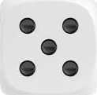</img>
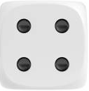</img>
</img>
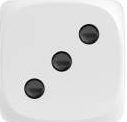</img>
</img>

---

class: inverse, middle, center

# Mettre sur pause
<hr width="65%" size="0.3" color="red" style="margin-top:-20px;"></hr>

---

# Le `pseudo-code`

## Exercice 2 (solution)

On se trouve à nouveau dans un cas où nous ne savons pas le nombre de lancers à effectuer. L'utilisation du while est alors nécessaire. On peut effectivement s'exprimer ainsi: "Tant que je n'ai pas obtenu la valeur 6, je lance mon dé à nouveau".

```
nb_lancer <- 1
READ result_de

WHILE result_de != 6
  nb_lancer <- nb_lancer + 1
  READ result_de
END WHILE
PRINT nb_lancer

Tant qu'il n'a pas obtenu la valeur 6
Il lance à nouveau le dé
L'expérience se termine lorsqu'il obtient la valeur 6
Il peut alors dire combien de lancer(s) ça lui a pris
```

---

# Le `pseudo-code`

## Exercice 2.1

Étant un peu vantard, Thomas aimerait ajouter à ses amis que d'obtenir 6 en lançant un dé n'est pas une expérience aléatoire (seulement dans son cas). Ainsi, s'il obtient la valeur 6 en un seul lancer, il aimerait leur indiquer: "je suis un maître lanceur!", alors que s'il l'obtient en plus d'un lancer, il aimerait leur mentionner que "le dé est forcément truqué!".

<div style='text-align:center;'>
</img>
</img>
</img>
</img>
</img>
</img>

---

class: inverse, middle, center

# Mettre sur pause
<hr width="65%" size="0.3" color="red" style="margin-top:-20px;"></hr>

---

# Le `pseudo-code`

## Exercice 2.1 (solution)

On cherche premièrement à reproduire le même pseudo-code que l'exemple initial. Puis, à la suite de l'expérience, on peut conclure dépendamment des `2` cas possibles.

```
nb_lancer <- 1
READ result_de

WHILE result_de != 6
  nb_lancer <- nb_lancer + 1
  READ result_de
END WHILE

IF nb_lancer = 1                    # Si un seul lancer fut nécessaire afin d'obtenir 6
  PRINT "Je suis un maître lanceur"
ELSE                                # Dans un cas contraire
  PRINT "Le dé est forcément truqué!"
ENDIF
```

---

# Le `pseudo-code`

## Exercice 2.2

Après quelques essais infructueux, Thomas se ravise. Il préférerait indiquer à ses amis qu'il a été chanceux si 1 seul lancer fut nécessaire, qu'il n'est pas chanceux lorsque le nombre de lancers fut entre 2 et 6, et qu'il est extrêmement mal chanceux de l'avoir obtenu en plus de 6 lancers.


<div style='text-align:center;'>
</img>
</img>
</img>
</img>
</img>
</img>
---

class: inverse, middle, center

# Mettre sur pause
<hr width="65%" size="0.3" color="red" style="margin-top:-20px;"></hr>

---

# Le `pseudo-code`

## Exercice 2.2 (solution)

Dans ce cas-ci, il y a `3` cas possibles.

```
nb_lancer <- 1
READ result_de

WHILE result_de != 6
  nb_lancer <- nb_lancer + 1
  READ result_de
END WHILE

IF nb_lancer = 1
  PRINT "J'ai été chanceux!"
IF ELSE nb_lancer > 6
  PRINT "Je suis extrêmement malchanceux..."
ELSE 
  PRINT "Je ne suis pas chanceux."
ENDIF


ELSE: Autrement (2,3,4,5,6)

```

---


# Exercice 3

Julie cherche à calculer la somme des chiffres de 1 à 79 à l'aide d'une boucle `for`. Elle vous demande de l'aide afin d'établir un pseudo-code.

---

class: inverse, middle, center

# Mettre sur pause
<hr width="65%" size="0.3" color="red" style="margin-top:-20px;"></hr>

---

# Solution de l'exercice 3

Manuellement, on cherche à faire: 1 + 2 + 3 + 4 + ... + 78 + 79.

On remarque que ça augmente par coup de 1, tout comme l'**indexation** de notre boucle *for*.

```
val_som <- 0

FOR (val_chiffre in 1:79)
  val_som <- val_som + val_chiffre
END FOR
```

---

# Exercice 4

Bruno et Martin s'entraînent au lancer du poids. Au cours des dernières années, ils ont dû s'affronter 10 fois dans des compétitions. Pour Bruno, son meilleur lancer (en mètres) pour chacune des compétitions est donné par le vecteur B. Les meilleurs lancers de Martin se trouvent dans le vecteur M.

```{r, echo = FALSE}
set.seed(5)
B <- round(runif(10,min = 11, max = 15), digits = 2)
M <- round(runif(10,min = 12, max = 16.5), digits = 2)
```

```{r}
B
M
```

Ainsi, pour accéder au résultat de Bruno lors de sa deuxième compétition, il suffit de noter l'indexation 2:

```{r}
B[2]
```

---

# Exercice 4 (suite)

On aimerait écrire le pseudo-code nous permettant de déterminer qui de Bruno ou Martin a obtenu le meilleur lancer pour chacune des compétitions.

---

class: inverse, middle, center

# Mettre sur pause
<hr width="65%" size="0.3" color="red" style="margin-top:-20px;"></hr>

---

# Solution de l'exercice 4 (tentative 1)

Une méthode (qui n'est pas la plus optimale) serait de comparer les lancers lors de chaque compétition *manuellement* et d'indiquer en fonction du résultat qui a obtenu le meilleur lancer:


## Compétition 1

```
IF B[1] < M[1]
  PRINT "Martin a gagné la compétition 1"
IF ELSE B[1] > M[1]
  PRINT "Bruno a gagné la compétition 1"
ELSE
  PRINT "Il y a eu égalité à la compétition 1"
ENDIF
```

---
# Solution de l'exercice 4 (tentative 1)


## Compétition 2

```
IF B[2] < M[2]
  PRINT "Martin a gagné la compétition 2"
IF ELSE B[2] > M[2]
  PRINT "Bruno a gagné la compétition 2"
ELSE
  PRINT "Il y a eu égalité à la compétition 2"
ENDIF
```


Et ainsi de suite... Par contre, on remarque que les seuls choses qui change d'une étape à l'autre est l'indexation des vecteurs B et M, ainsi que la valeur qui suit le mot compétition!

---
# Solution de l'exercice 4 (tentative 2)

Il est alors possible de passer une boucle `for` où les indexations seront le numéro de la compétition qui augmentera de 1 à 10:

```
FOR NumCompet in 1:10
  IF B[NumCompet] < M[NumCompet]
    PRINT ("Martin a gagné la compétition" NumCompet)
  IF ELSE B[NumCompet] > M[NumCompet]
    PRINT ("Bruno a gagné la compétition" NumCompet)
  ELSE
    PRINT ("Il y a eu égalité à la compétition" NumCompet)
  ENDIF
END FOR
```


---
# Exercice 5

1. On jette en face de vous 5 lettres d'un jeu de scrabble
2. Un maniac vous demande d'écrire un programme permettant d'ordonner les 5 lettres

Prenez le temps de distinguer les étapes que vous réalisez lorsque vous triez les lettres. Essayez de les décrire sous forme de pseudo-code.

Note: L'utilisation de booléen peut être utile. `is.sort = FALSE` indique que les 5 lettres ne sont pas ordonnées!

---

class: inverse, middle, center

# Mettre sur pause
<hr width="65%" size="0.3" color="red" style="margin-top:-20px;"></hr>

---

# Solutions de l'exercice 5

Ordonner un vecteur `X` composé de 5 lettres de Scrabble

.pull-left[
## Solution 1: Tri bulle

```
WHILE is.sort = FALSE
  is.sort = TRUE
  FOR pos IN 1:4
    IF X[pos] > X[pos+1]
      INVERSE
      is.sort = FALSE
    END IF
  END FOR
END WHILE  
```
]

.pull-right[

## Solution 2: Tri aléatoire

```
WHILE is.sort = FALSE
  is.sort = TRUE
  MELANGE X
  FOR pos IN 1:4
    IF X[pos] > X[pos+1]
      is.sort = FALSE
    END IF
  END FOR
END WHILE  
```
]

---

# 5 raisons pour utiliser R

R est un langage de programmation en source libre conçu pour l'analyse statistique, l'analyse de données et la visualisation. R n'est cependant pas optimisé pour la performance, mais néanmoins, il est fort utile pour l'apprentissage de la programmation en raison de sa convivialité (!) et de sa facilité de `débogage` (!!)

## Les arguments en faveur de R:

1. Gratuit et ouvert (open-source)
2. Communauté active (Scientifique, mais aussi StackOverflow, R-Bloggers)
3. Diversité d'utilisateurs et de contributions
4. En phase avec les nouvelles technologies statistiques
5. Intégration du langage de programmation avec les outils de visualisation et de manipulation des données

---

# Interagir avec R sur la console

<div style='text-align:center;'>
</img>
</div>

---

# Utiliser R Studio

<div style='text-align:center;'>
</img>
</div>

---

# Exercice : interaction avec la ligne de commande

Le plus simple est d'utiliser R comme une calculatrice.

## Que donne l'opération suivante ?

```{r eval=FALSE}
2 + 16 * 24 - 56
```

---

# Répertoire de travail

## Savoir où on est

```{r}
getwd()
```

---

# Répertoire de travail

## Changer le répertoire de travail

- Pour les utilisateurs Mac et Linux:

```{r eval=FALSE}
setwd("/home/bera1923/Desktop/Ateliers_ALEA/Atelier_1")
```

- Pour les utilisateurs Windows:

```{r eval=FALSE}
setwd("C:/Users/bera1923/Desktop/Ateliers_ALEA/Atelier_1")
```

Le `c:` correspond à la partition du disque.

<!-- Les chemins d'accès ressemblent généralement à ça: `c:\Documents\BIO109\cours2`
Le problème étant que le backslash est utilisé pour marquer un espace dans le nom d'un répertoire sous Linux -->

---

# Répertoire de travail

## Changer le répertoire de travail

Pour les utilisateurs R Studio : 

> RStudio -> session -> set working directory 

Pour les utilisateurs R GUI (Windows):

> file -> set working directory

Pour les utilisateurs R GUI (Mac):

> file -> set working directory
---

# Environnement de travail

## Obtenir le contenu du dossier dans le répertoire de travail

```{r}
dir()
```

## Obtenir la liste des objets en mémoire

```{r}
ls()
```

---

# Environnement de travail

## Effacer un objet en mémoire:

```{r}
test <- 1
ls()
rm(test)
ls()
```

---

# Le script 

Un script est un fichier `.R` contenant une série d'instructions et de commentaires pour réaliser des opérations sur R. Le script est utilisé pour conserver l'historique des opérations et les répéter au besoin.

Un bon éditeur de script (e.g. RStudio ou R GUI) permet d'exécuter une ligne de commande à la fois, un bloc de commandes ou encore l'ensemble du script (avec crtl + enter ou fonction + R).

Il est préférable d'utiliser uniquement le script et de l'enregistrer et de ne pas enregistrer le contenu de la console. Ainsi la reproductibilité est assurée. 

---

# Le script : fonction source

Il est possible d'exécuter un script sans avoir à l'ouvrir. 

```{r eval = FALSE}
source("MonScript.R")
```

---

# Le concept d'objet

Un objet peut contenir de l'information de toute nature: un tableau de données, les résultats d'une analyse, une figure, une fonction, ...

## La commande pour créer un objet `a` est composé de trois parties:

1. une valeur d'intérêt
2. un identifiant (soit un nom d'objet)
3. l'opérateur d'assignation

```{r}
a <- c(1,2)
a
```

---

# Le concept d'objet

Un objet peut contenir de l'information de toute nature: un tableau de données, les résultats d'une analyse, une figure, une fonction, ...

## La commande pour créer un objet `a` est composé de trois parties:

1. une valeur d'intérêt
2. un identifiant (soit un nom d'objet)
3. l'opérateur d'assignation

```{r}
a <- c(1,2)
a
```

- Notons que les opérateurs `<-` et `=` sont équivalents pour attribuer une valeur à un objet.
- L'opérateur `<-` sera toutefois préféré. (<-)

---
class: middle, center, inverse

# Les types de valeurs assignables à un objet
<hr width="65%" size="0.3" color="orange" style="margin-top:-20px;"></hr>


---
# Assigner une valeur de type `numérique`

## Les données numériques peuvent être déclarées de différentes manières

```{r}
a <- 1
a
b <- 1.1
b
c <- 1e-6
c
```

---
# Assigner une valeur de type `caractère`

## On peut également déclarer des séries de caractères

```{r}
test <- "test"
test
```

**Important** - Les valeurs de type `caractère` doivent être placées entre guillemets. Cette nomenclature permet de différencier une valeur du nom d'un objet.


---
# Assigner une valeur de type `caractère`

## Finalement, des séries de caractères peuvent être collées entre elles pour créer des chaines de caractères.

```{r}
collage <- paste("R","S","T","U","D","I","O", sep="")
collage
```

---

# Assigner une valeur de type `booléen`

Le type `booléen` (logical) permet de représenter les états `TRUE` (1) et `FALSE` (0) et de faire des opérations mathématiques sur des objets.

```{r}
vrai <- TRUE
faux <- FALSE
vrai
vrai + faux
```

---

# Assigner une valeur de type `facteur`

R est d'abord un langage utilisé pour les statistiques et par conséquent, on y retrouve un type de données utilisé pour la réalisation de tests d'hypothèse, qui ne sont pas standard à tous les langages. Les facteurs sont des données catégoriques.

```{r}
MesFacteurs <- factor(c("Categorie1","Categorie2","Categorie3","Categorie2","Categorie3","Categorie3","Categorie1","Categorie2"))
MesFacteurs
```

```{r}
Scol <- factor(c("Sec","Col","Uni","Uni","Col","Uni","Col","ind"))
Scol
```

Niveau de scolarité: secondaire, collégial, universitaire, indéterminé.

---
class: middle, center, inverse

# Conversion entre types de valeur
<hr width="65%" size="0.3" color="orange" style="margin-top:-20px;"></hr>


---

# Conversion entre types de valeur

R permet de convertir des objets en différents types de données lorsque le contenu le permet.

## Conversion vers les types `numérique` et `caractère`:

```{r}
as.numeric(c("4","6"))
as.character(c(4,6))
as.numeric(c("a","7"))
```

---

# Conversion entre types de valeur

## Conversion vers les types `facteurs` et nombre `entier`:

```{r}
as.integer(2.6)
as.factor(c("4","6"))
```

---

# Conversion entre types de valeur

## Conversion vers le type `booléen`:

```{r}
as.logical(0)
as.logical(1)
as.logical(2)
```

---
class: middle, center, inverse

# Les types d'objets
<hr width="65%" size="0.3" color="orange" style="margin-top:-20px;"></hr>

---

# Les types d'objets

Depuis le début de l'atelier, nous avons très souvent assigné une seule valeur à un objet. Lorsqu'un objet contient une seule valeur, on dit que c'est un objet `scalaire`.

```{r}
a <- 1
a
```

Cependant, un objet peut contenir plusieurs valeurs. Dans un tel cas, il sera alors défini comme un `vecteur`.

---

# Type d'objets: les `vecteurs`

Le vecteur est un des objets les plus importants de R.

## La façon la plus simple de déclarer un vecteur est:

```{r}
MonPremierVecteur <- c(1,2,3,4,5)
MonPremierVecteur
```


**Note** - D'autres méthodes seront présentées dans un futur proche.

---

# Type d'objets: les `vecteurs`

La force de R repose dans sa capacité à réaliser des opérations `vectorielles`.

Il est ainsi possible d'additionner simplement deux vecteurs d'une même dimension de la façon suivante:

```{r}
MonPremierVecteur <- c(1,2,3,4,5)
MonDeuxiemeVecteur <- c(11,12,13,15,16)
MonPremierVecteur + MonDeuxiemeVecteur
```

---

# Exercice  

Créez un vecteur contenant les valeurs `[-1,2,5,9]`. Par la suite, calculez la racine carrée de ces nombres au moyen de la fonction `sqrt()`.

---

class: inverse, middle, center

# Mettre sur pause
<hr width="65%" size="0.3" color="red" style="margin-top:-20px;"></hr>

---

# Solution

On obtient un `NaN` lorsqu'on effectue des opérations qui ne font pas de sens ou encore lorsque le résultats de notre opération n'est pas un nombre. 

```{r}
MonVecteur <- c(-1,2,5,9)
sqrt(MonVecteur)
```

Certaines fonctions renvoient également des avertissements pour prévenir l'utilisateur qu'il y a peut-être quelque chose d'anormal.

---

# Types d'objets: les `vecteurs`

On peut accéder à une position sur le vecteur au moyen d'un `index`, indiqué par les `[]`

```{r}
MonPremierVecteur <- c(1,2,3,4,5)
MonPremierVecteur
MonPremierVecteur[3]
```

On obtient un `NA` si on tente d'accéder à une position qui n'existe pas:

```{r}
MonPremierVecteur <- c(1,2,3,4,5)
MonPremierVecteur[6]
```

---

# Exercice  

Au moyen du vecteur créé précédemment, calculer le produit des valeurs aux positions `2` et `4`.

```{r}
MonVecteur
```

---

class: inverse, middle, center

# Mettre sur pause
<hr width="65%" size="0.3" color="red" style="margin-top:-20px;"></hr>

---

# Solution

```{r}
MonVecteur <- c(-1,2,5,9)
MonVecteur[2]*MonVecteur[4]
```

---

# Types d'objets: les `vecteurs`

Il est possible d'obtenir la dimension de notre vecteur à l'aide de la fonction length().

```{r}
MonPremierVecteur <- c(1,2,3,4,5)
length(MonPremierVecteur)
```

---

# Types d'objets: les `matrices`

L'extension naturelle d'un vecteur est une `matrice`, soit une collection de vecteurs.
R est également optimisé pour réaliser des opérations mathématiques et de manipulation de données sur ce type d'objets.

## La commande de base pour créer une matrice est `matrix()`

```{r}
MaMatrice <- matrix(c(1,2,3,4,5,6), nrow = 2, ncol = 3)
MaMatrice
```

---

# Types d'objets: les `matrices`

On accède à la ligne `i` et la colonne `j` au moyen de la commande MaMatrice[i,j]. Ainsi, pour accèder à l'élément de la première ligne et de la deuxième colonne, on doit utiliser la commande suivante

```{r}
MaMatrice[1,2]
```

---

# Types d'objets: les `matrices`

On peut aussi accéder à des lignes ou des colonnes entières

```{r}
MaMatrice[1,]
MaMatrice[,1]
```

---

# Types d'objets: les `matrices`

On obtient la dimension de la matrice ainsi

```{r}
dim(MaMatrice)
```

Dans le cas des matrices, length() nous indiquerait le nombre total d'éléments dans la matrice.

---

# Types d'objets: les `matrices`

## Ou encore

```{r}
nrow(MaMatrice)
ncol(MaMatrice)
```

---

# Types d'objets: les `matrices`

Le nom des colonnes et des lignes peut être modifié

```{r}
colnames(MaMatrice) = c("A","B","C")
rownames(MaMatrice) = c("X","Y")
MaMatrice
```

---

# Exercice  

Créez une matrice de 2 lignes et 5 colonnes remplies de chiffres tirés au hasard entre 0 et 100. Pour ce faire, vous pouvez utiliser la fonction `runif()`. Calculez la somme de la première colonne au moyen de la fonction `sum()`

**Astuce** : pour obtenir de l'aide sur une fonction, essayez

```{r eval = FALSE}
?runif()
```

---

class: inverse, middle, center

# Mettre sur pause
<hr width="65%" size="0.3" color="red" style="margin-top:-20px;"></hr>

---

# Solution

En roulant `?runif()`, la page de documentation de la fonction s'ouvre. On peut alors voir quels sont les arguments de cette fonction et comment utiliser la fonction.

```{r eval = FALSE}
Description
These functions provide information about the uniform distribution on the interval from min to max. dunif gives the density, punif gives the distribution function qunif gives the quantile function and runif generates random deviates.
```

```{r eval = FALSE}
Usage
runif(n, min = 0, max = 1)
```

```{r eval = FALSE}
Argument
n : number of observations. If length(n) > 1, 
the length is taken to be the number required.
min, max : lower and upper limits of the distribution. 
Must be finite
```
---

# Solution

On peut alors créer la matrice suivante

```{r}
MaPremiereMatrice <- matrix(runif(2*5, 0, 100), nrow = 2, ncol = 5)
MaPremiereMatrice
sum(MaPremiereMatrice[,1])
```


---

# Type d'objets: les `listes`

R peut organiser également des collections d'objets sous forme de liste. Ces collections peuvent être très hétérogènes et rassembler par exemple, des vecteurs et matrices, mais aussi des objets plus complexes et hiérarchiques comme des résultats d'analyses statistiques.

## La création et l'indexation des listes sont très similaires à celle des vecteurs et matrices

```{r}
MaListe = list()
MaListe[[1]] = c(1,2)
MaListe[[2]] = matrix(c("A","B","C","D"), nrow = 2, ncol = 2)
```

`MaListe[[1]]` permet d'obtenir l'objet contenu par le premier niveau de la liste.

---

# Type d'objets: les `listes`

## Et de même on peut nommer les items d'une liste

```{r}
names(MaListe) <- c("Vecteur","Matrice")
MaListe
```

---

# Type d'objets: les `listes`

On pourra alors avoir accès à un élément de la liste par indexation avec l'accesseur `[[]]` :

```{r}
MaListe[[2]]
```

ou encore avoir accès à ce même élément de la liste par référence à son nom avec l'accesseur `$` :

```{r}
MaListe$Matrice
```

---

# Type d'objets: les `data.frame`

## Le `data.frame` se décrit comme un tableau de données, avec les rangées `i` et les colonnes `j`, ainsi que des noms de colonnes.

```{r}
df <- data.frame(a = c(1:3), b = c(11:13))
df
df$a
```

On peut indexer une colonne directement avec l'accesseur `$`

---

# Type d'objets: les `data.frame`

## Un `data.frame` peut avoir différents types de valeur pour chaque colonne

```{r}
df2 <- data.frame(a = c(1:3), traitement = factor(c("trait1","trait2","trait3")), verite = c(T, F, T) )
df2
```

Cette capacité à entreposer plusieurs types de valeur est ce qui distingue un `data.frame` d'une matrice.

---

# Type d'objets: les `data.frame`

## On peut néanmoins transformer un `data.frame` en matrice

```{r}
as.matrix(df)
as.matrix(df2)
```

---

# Type d'objets: les `data.frame`

## Ou inversement, transformer une matrice en `data.frame`

```{r}
mat <- matrix(c(1:6), nrow = 3, ncol = 2)
as.data.frame(mat)
```

---

class: inverse, middle, center

# Exercices 
<hr width="65%" size="0.3" color="orange" style="margin-top:-20px;"></hr>


---

# Exercice 1

Soit le tableau suivant:

```{r}
note <- read.table(file = './donnees/NoteEtudiant.txt', sep="\t", header = TRUE)
head(note)
```

1- Étant l'étudiant numéro 2, j'aimerais calculer ma moyenne générale. 

2- Étant le professeur d'anglais, j'aimerais calculer la moyenne de ma classe.

À l'aide d'un pseudo-code, répondez à (1) et (2).

---

class: inverse, middle, center

# Mettre sur pause
<hr width="65%" size="0.3" color="red" style="margin-top:-20px;"></hr>

---

# Solution de l'exercice 1

.pull-left[
## Solution 1:

```
NbCours <- 6
Somme <- 0

FOR posC IN 1:NbCours
  Somme <- Somme + note[2,posC]
END FOR
Moyenne <- Somme/NbCours


ET


mean(note[2,])
```

]

.pull-right[

## Solution 2:

```
NbEtudiant <- 5
Somme <- 0

FOR posL IN 1:NbEtudiant
  Somme <- Somme + note[posL,3]
END FOR
Moyenne <- Somme/NbEtudiant


ET


mean(note[,3])
```
]


---

# Exercice 2

Soit le tableau suivant:

```{r}
note <- read.table(file = './donnees/NoteEtudiant.txt', sep="\t", header = TRUE)
head(note)
```

En temps que directeur d'une école, je souhaite obtenir la moyenne générale de mon établissement scolaire. Ainsi, je souhaiterais obtenir la moyenne des moyennes générales de chaque étudiants. À l'aide de boucle `for`, définissez un pseudo-code permettant de calculer la moyenne de l'établissement scolaire.

---

class: inverse, middle, center

# Mettre sur pause
<hr width="65%" size="0.3" color="red" style="margin-top:-20px;"></hr>

---

# Solution de l'exercice 2

```
NbEtudiant <- 5
NbCours <- 6
Somme <- 0

FOR posL IN 1:NbEtudiant
  FOR posC IN 1:NbCours
    Somme <- Somme + note[posL,posC]
  END FOR
END FOR
MoyGen <- Somme/(NbEtudiant * NbCours)


ET


sum(note)/(NbEtudiant * NbCours)
```

---

class: middle, center, inverse

# Interagir avec ses fichiers
<hr width="65%" size="0.3" color="orange" style="margin-top:-20px;"></hr>


---

# Lire un fichier

La lecture de fichiers est souvent l'étape la plus frustrante lorsque l'on travaille avec R.

Pour ce faire, nous utiliserons les fichiers sous format `CSV` (*Comma Separated values*) ou `txt` qui sont des fichiers de texte brut dont chaque ligne dispose d'un séparateur de colonne.

---

# Lire un fichier

Si j'ouvre le fichier [Canadiens.csv](./donnees/Canadiens.csv) avec un bloc-notes, j'obtiens les 5 premières lignes suivantes:

```
Joueurs;Buts;Tirs;Points;Parties jouees;Position
Tomas Tatar;22;162;61;68;AG
Phillip Danault;13;131;47;71;C
Max Domi;17;179;44;71;C
Brendan Gallagher;22;226;43;59;AD
```

On voit ici le point virgule comme séparateur de colonne. La première ligne correspond aux noms des colonnes.

**Note:** Garder à l'esprit que de connaître la structure du fichier facilite grandement l'importation des données dans R.

---

# Lire un fichier Excel

Les fichiers `.xlsx` peuvent être lus au moyen de librairies spécialisées, mais il est préférable sous R d'utiliser un format multi-plateforme ouvrable sans logiciels propriétaires.

---

# Ouvrir un fichier `.csv` dans R

Nous allons utiliser le fichier [Canadiens.csv](./donnees/Canadiens.csv) pour cet exemple.

## On peut lire le fichier au moyen de la commande

```{r}
Canadiens <- read.table(file = "donnees/Canadiens.csv", header = T, dec = ".", sep = ";")
head(Canadiens)
```

---

# Lire un fichier `.csv`: anatomie des arguments

- `file` : nom du fichier à lire
- `header` : indique s'il y a un entête avec les noms de colonnes
- `dec` : caractère utilisé pour délimiter les décimales
- `sep` : caractère utilisé pour séparer les colonnes
- `quote` : spécifie si les chaines de caractère sont entourées par des guillemets.

**Note** : l'objet retourné est par défaut un `data.frame`. Il peut être ensuite converti, au besoin.

---

# Lire un fichier: les erreurs courantes

- Mauvais nom de fichier
- Mauvais répertoire de travail
- Guillemets
- Type de séparateur de colonnes
- Présence de points
- Nom des colonnes
- Entrées vides
- Présence de caractères invisibles
- Mauvais encodage des données
- Type de données et d'objets

---

# Écrire des fichiers `CSV` et `txt`

Il y a une grande diversité de façons d'enregistrer sur le disque des objets provenant de R. La façon la plus simple, versatile et qui permet les échanges entre différents logiciels et systèmes d'exploitation est d'écrire sous format `CSV`.

La syntaxe pour écrire une `matrice` ou un `data.frame` est aussi simple que pour lire un fichier `CSV`.

```{r eval=FALSE}
mat2 <- matrix(runif(n = 50,min = 0,max = 1),nrow = 5,ncol = 10)
write.table(mat2, file = "mat.csv")
```

---

# Écrire des fichiers `.Rdata` avec `save()`

Parfois les objets que l'on souhaite enregistrer ont une structure plus complexe qu'un tableau de données. R permet d'enregistrer ces objets dans un format qui lui est unique, le `.Rdata`. Ces objets sont compressés pour minimiser l'espace disque et ne peuvent être lus uniquement par R.

```{r}
MaListe <- list()
MaListe[[1]] <- 1
MaListe[[2]] <- c(1:10)
save(MaListe, file = "MaListe.Rdata")
```

**NOTE** - `save()` permet également de sauvegarder plusieurs objets.

```{r eval=FALSE}
save(MaListe,MonDataFrame, file = "MaListe.Rdata")
```

---

# Lire des fichiers `.Rdata` avec `load()`

Puisque le fichier `.Rdata` est spécifique à R, il s'agit peut-être du format le plus facile à lire puisque R prend en charge la mise en forme de l'objet, les noms et les types de données

```{r}
load("MaListe.Rdata")
ls()
```

---

# Lire des fichiers: `load()` et `.Rdata`

Faites attention, si le nom de l'objet contenu dans le fichier `.Rdata` est le même qu'un objet en mémoire, il va écraser ce premier objet.

```{r}
MaListe <- list("Hello","World")
load("MaListe.Rdata")
MaListe
```

## Pour éviter cette erreur, il faut utiliser les fonctions `saveRDS()` et `readRDS()`.

---

# Quelques commandes utiles

Il est important de vérifier la structure de l'objet après son importation dans l'environnement R.

```{r}
head(Canadiens, n = 3)
tail(Canadiens, n = 3)
```

---

# Quelques commandes utiles

Il est important de vérifier la structure de l'objet après son importation dans l'environnement R.

```{r}
str(Canadiens)
```

---

# Quelques commandes utiles

`summary()` permet d'obtenir un résumé du contenu de chaque colonne

```{r}
summary(Canadiens)
```

---

# Quelques commandes utiles

Très souvent, on souhaite réaliser un sommaire de nos données. La fonction `summary()` est fort utile, mais parfois on souhaite avoir d'autres informations que la moyenne (p. ex. la variance). Dans ce cas, la fonction `table()` est recommandée.

```{r}
Tirs <- table(Canadiens$Tirs)
Tirs
```

---

# Exercice de manipulation des données

- Ouvrir le fichier [ButsResult.csv](./donnees/ButsResult.csv) au moyen de Excel
- Ouvrir le même fichier au moyen de R

Dans Excel: 
- Calculer le nombre moyen de buts marqué par le Canadiens de Montréal en fonction des résultats de la partie. 
- Exprimer le résultat en un tableau avec titres au colonne.

Dans R:
- Vérifier que le fichier a le format approprié.
- Créer un vecteur `ButsMoyen` d'une longueur correspondant au nombre de catégories de résultat d'une partie dans le fichier de données.
- Attribuer les types de résultats pour chaque entrée de `ButsMoyen`.
- Enregistrer le fichier sous forme de fichier `csv` et comparer le avec le fichier Excel.

---

# Exercice de manipulation des données (suite)

Dans Excel:
- Afin de calculer le nombre moyen de buts marqué en fonction des différents résultats d'une partie sur Excel, nous devons calculer (en exemple, pour les défaites): `Somme` de `Nombre de buts marqué * Nombre de défaites par ce nombre de buts`, puis diviser cette somme par le nombre total de défaites. (Répéter pour les égalités et les victoires)

Il suffit ensuite d'ajouter `Défaite`, `Égalité` et `Victoire` comme titre de nos trois colonnes.


---
# Exercice de manipulation des données (suite)

Dans R:
- D'abord, on importe nos données (`read.table()`).
- On calcule avec la même méthode que pour le Excel, le nombre moyen de buts en fonction du résultat de la partie.
- Convertir le vecteur `ButsMoyen` en tableau de données. (`as.data.frame()`)
- Attribuer les noms des positions pour chaque entrée de `ButsMoyen`. (`Colnames()`)
- Enregistrer `ButsMoyen` sous forme de fichier `CSV`. (séparateur point-virgule) (`write.table()`)
- Ouvrir le fichier `CSV` et le comparer au résultat de l'étape 1 dans Excel.

**Note 1:** La fonction t() vous permet de transposer un tableau. (3 lignes, 1 colonne devient 1 ligne, 3 colonnes)

**Note 2:** ?colnames (par exemple) dans la console permet d'ouvrir la fenêtre d'aide de cette fonction.

---
class: middle, center, inverse

# Manipulation des données
<hr width="65%" size="0.3" color="orange" style="margin-top:-20px;"></hr>


---

# Différents outils pour générer des données

```{r}
seq(from = 1, to = 10, by = 0.5)
rep(c(1:3), times = 3)
```

---

# Différents outils pour générer des données

```{r}
v1 <- c(1:3)
v2 <- c("A","B","C")
expand.grid(v1,v2)
```

---
# Combiner des objets

```{r}
rbind(v1,v2)
cbind(v1,v2)
```

---

# Fonctions utiles: trier des objets

```{r}
tri <- runif(n = 10, min = 0, max = 100)
tri
sort(tri)
```

---
# Fonctions utiles: obtenir des rangs

```{r}
rang <- runif(n = 10, min = 0, max = 100)
rang
rank(rang)
```

---

# Fonctions utiles: éch. les valeurs uniques

```{r}
uq <- c(1,2,5,7,4,3,2,1,10,5,8)
uq
unique(uq)
```

---
# Sous-échantillonner des objets

Parfois, on souhaite avoir seulement une partie des données contenues dans un objet. La fonction `subset()` est fort pratique pour réaliser cette opération.

Ici par exemple, on souhaite étudier seulement les joueurs du Canadiens ayant au moins 15 buts et au moins 40 points:

```{r}
Canad <- read.table(file="donnees/Canadiens.csv", header=TRUE, stringsAsFactors=FALSE, sep = ";")
sub_Centres <- subset(Canad, Canad$Buts >= 15 & Canad$Points >= 40)
head(sub_Centres, n=3)
```

Le ">=" est utilisé pour le `au moins` (plus grand ou égal) et le symbole "&" pour combiner deux conditions. (agit en tant que ET)

---
# Exercice récapitulatif de l'atelier

Le fichier [ExerciceRecapitulatif.csv](./donnees/ExerciceRecapitulatif.csv) est un sommaire des données sur le virus qui frappe présentement la planète Erret: Le Divoc-91!

À partir de ces données, le docteur Kombucha aimerait avoir un tableau détaillé du nombre de jours qu'un individu à passé à l'hôpital en fonction de sa région. 

De plus, il aimerait qu'au bas du premier tableau figure les différents coûts de traitement par région. Les frais sont les suivants: 10*$* pour les résidents de la Capitale-Nationale, du Centre-du-Québec, des Chaudières-Appalaches ainsi que de Lanaudière. Les frais de la Montérégie sont les plus élevés et s'élèvent à 15*$* par individu, alors que pour les autres régions, les frais s'élèvent à 5*$* par personne.

M. Kombucha vous demande de rédiger un script qui réalisera l'ensemble de ces étapes, de la lecture des données à l'enregistrement du tableau final.

---
# Indications

1. Charger les données "ExerciceRecapitulatif". (vous pouvez modifier le nom des colonnes si nécessaire)
2. Créer le premier tableau demandé.
3. Créer un vecteur des frais par région.
4. Combiner le premier tableau au vecteur, de sorte que les frais soient **au bas** du tableau.
5. Enregistrer les résultats dans un tableau où les étiquettes de rangées correspondent aux nombres de jours passés à l'hôpital (la dernière ligne correspondra au frais totaux par région) et les étiquettes des colonnes correspondent aux régions.


---
# Suite

Le tableau final doit avoir la forme de l'image ci-dessous.

<div style='text-align:center;'>
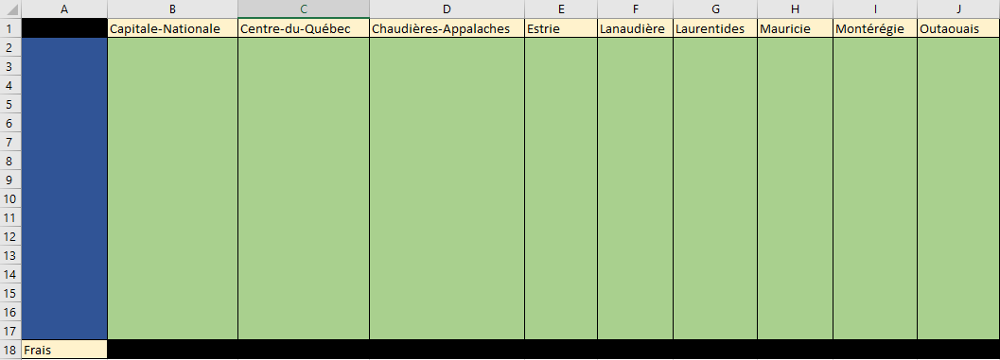</img>

En utilisant **seulement** le tableau final obtenu à la question précédente, expliquez comment vous procéderiez (à l'aide d'un pseudo-code) afin de calculer le nombre total d'individu ayant eu besoin d'aller à l'hôpital plus d'une journée.

