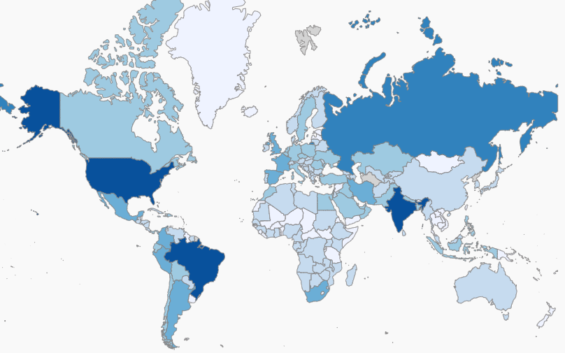

class: title-slide, middle

<style type="text/css">
  .title-slide {
    background-image: url('assets/img/Coding.png');
    background-color: #23373B;
    background-size: contain;
    border: 0px;
    background-position: 600px 0;
    line-height: 1;
  }
</style>

# Bienvenue à l'atelier 1

<hr width="65%" align="left" size="0.3" color="orange"></hr>

### Introduction à la programmation scientifique et au langage R

<hr width="65%" align="left" size="0.3" color="orange" style="margin-bottom:40px;" alt="@Martin Sanchez"></hr>

.instructors[
  ***ALÉA R*** - Antoine Bergeron
]

</img>

---

# Présentation


---
class: inverse, middle, center

# L'idée derrière l'ordinateur!
<hr width="65%" size="0.3" color="orange" style="margin-top:-20px;"></hr>

---

# Introduction

<div style='text-align:center;'>
</img>
</div>


---

# Le type de données

```{r}
can <- read.table(file = './donnees/canadiens.txt', sep="\t", header = TRUE)
head(can)
```

---

# Le type de données 

```{r}
parties <- read.table(file = './donnees/parties.txt', sep="\t", header = TRUE)
head(parties)
```

---

# Exercice 1

Ouvrir le fichier [parties](./donnees/parties.xlsx) avec Excel et trouver le nombre de buts marqués par les Canadiens de Montréal en fonction du résultat de la partie.

---

# Exercice 1: solution sur R

```{r}
parties <- read.table(file = './donnees/parties.txt', sep="\t", header = TRUE)
ButsResult <- table(parties$Buts.pour,parties$Resultat)
head(ButsResult)
```

```{r, echo=FALSE}
write.table(ButsResult, file="./donnees/ButsResult.txt",sep="\t",quote=TRUE)
```
---

# Exercice 2

Ouvrir le fichier [ButsResult](./donnees/ButsResult.xlsx) avec Excel et calculer la corrélation entre les différents résultats d'une partie.

Indice: sur Excel, la fonction pour calculer une corrélation est:

```bash
=COEFFICIENT.CORRELATION(données_1; données_2)
```

---

# Exercice 2: solution sur R

```{r,eval=FALSE}
ButsResult <- read.table(file = './donnees/ButsResult.txt', header = TRUE, sep= "\t")
cor(ButsResult)
```

```{r,eval=TRUE,echo=FALSE}
ButsResult <- read.table(file = './donnees/ButsResult.txt', header = TRUE, sep= "\t")
round(cor(ButsResult),6)
```

---

# Exercice 2: visualisation sur R

```{r,  fig.width= 6, fig.height= 6, fig.align='center'}
plot(ButsResult)
```

---

# Objectif général

Au terme de cet atelier, vous serez en mesure de conceptualiser un problème qui requiert de la programmation scientifique et de réaliser des tâches courantes de programmation.


---

# Objectifs spécifiques

1. Charger des données et exporter des résultats d'analyse au moyen du
    logiciel R;
2. Conceptualiser un problème au moyen de pseudo-code;
3. Manipuler des données;
4. Rédiger des fonctions;
5. Programmer des algorithmes afin de réaliser des tâches complexes,
    incluant des boucles et des énoncés conditionnels;
6. Réaliser des simulations de Monte Carlo;

---
# Contenu

1. Introduction et bonnes pratiques de programmation
2. Interagir avec R
3. Les fonctions
4. Algorithmique I: boucles et conditions
5. Algorithmique II: simulations de Monte Carlo

---

# Ce que le cours n'est pas ...

1. Des recettes
2. Un catalogue de fonctions R
3. Un cours de statistiques

---

# Approche

Les connaissances requises pour la programmation scientifique sont
minimales, l'apprentissage porte davantage sur l'acquisition de
compétences et le développement de capacités à la résolution de problèmes.


L'atelier sera constitué de courtes leçons magistrales sur des
notions de base de programmation, entre-coupées d'exercices spécifiques
destinés à pratiquer les éléments enseignés. L'atelier se terminera avec
la réalisation d'un exercice intégrateur à compléter à la maison.

L'ensemble du matériel du cours sera disponible sur un dépôt Git à l'adresse :
https://github.com/AntoineBergeron/Ateliers_ALEA

---
class: inverse, center, middle

# La place de la programmation dans le monde
<hr width="65%" size="0.3" color="orange" style="margin-top:-20px;"></hr>


---

# Hier

<div style='text-align:center;'>
</img>
</div>

---

# Aujourd'hui

<div style='text-align:center;'>
</img>
</div>


---

# Et demain...

Google Duplex

<a href="http://www.youtube.com/watch?feature=player_embedded&v=yDI5oVn0RgM
" target="_blank"></a>

---

# Progression de la puissance de calcul

<div style='text-align:center;'>
  </img>
</div>

<!-- Ces questions sont rendu possible en partie grâce à l'augmentation de la puissance de nos ordinateurs et l'accessibilité aux données -->


---

# Utilisation en recherche au quotidien

La programmation est un outil indispensable au chercheur 2.0, elle permet de réaliser:

- Tâches répétitives et/ou complexes (p. ex. Nettoyage des données, Simulations stochastiques)
- Visualisation et exploration des données
- Analyses statistiques avancées (p. ex. Tests par permutations)

---

# La programmation en recherche

.pull-left[
## Avantages

- Gain de temps
- Limiter les erreurs
- Formaliser les opérations
- Archiver, reproduire et partager
- Tâches intensives (e.g. en génomique)
]


.pull-right[
## Augmentation du volume de données génomiques
</img>
<span style="font-size:small;text-transform:uppercase;text-align:right;">
[Nature 2013](http://www.nature.com/nature/journal/v498/n7453/full/498255a.html)
</span>
]

---

# La programmation en recherche

</img>

<!-- Feuille personnalisé  -->

---

# La programmation en recherche

Screenshot des feuilles corrigés à MF St-C en adaptation scolaire

---

# La programmation en recherche

.pull-left[
## Inconvénients

- L'erreur est avant tout humaine, avant d'être informatique
- La courbe apprentissage peut être difficile
]

.pull-right[
</img>
]

---
class: inverse, middle, center

# Le Pseudo-Code
<hr width="65%" size="0.3" color="orange" style="margin-top:-20px;"></hr>

---

# Le `Pseudo-Code` et ses **algorithmes**


## Définitions

- *En programmation, le `pseudo-code` est une façon de formuler un <b>algorithme</b> sans référence à un langage de programmation en particulier.*

> - *Un <b>algorithme</b> est une suite d'actions qui sont réalisées dans un ordre précis par l'ordinateur. C'est une séquence d'étapes dans la résolution d'un problème.*

---

# Le `Pseudo-Code`

## Exemple

```
PROGRAM DEMO
  FOR t IN 1:100
    n_t = n_t * lambda
    PRINT n_t
    IF n_t < 1
      BREAK
    ELSE
      CONTINUE
    END IF
  END FOR
```

Le programme `DEMO` fait croitre une population de taille initiale $n_t$ à un taux $\lambda$ et affiche à l'utilisateur si la population est éteinte $n_t<1$ ou vivante $n_t>1$.

---

# Le `Pseudo-Code`

## Exemple

```
PROGRAM DEMO
  FOR t IN 1:100 <------------- Opération itérative
    n_t = n_t * lambda
    PRINT n_t <---------------- Le programme affiche la valeur à l'écran
    IF n_t < 1 <--------------- Opération décisionnelle
      BREAK <------------------ Le programme arrête son éxécution
    ELSE
      CONTINUE <--------------- Le programme continue son éxécution
    END IF
  END FOR
```

Le programme `DEMO` fait croitre une population de taille initiale $n_t$ à un taux $\lambda$ et affiche à l'utilisateur si la population est éteinte $n_t<1$ ou vivante $n_t>1$.


---

# Les structures de base d'un algorithme

On retrouve 3 familles d'opérations:

1. Les opérations séquentielles
2. Les opérations itératives (`FOR`, `WHILE`)
3. Les opérations décisionnelles (`IF`, `IFELSE`)

---

# Avant-propos

Avant de décrire chacune des opérations d'un algorithme, certaines instructions sont communes:

- `READ`: Le programme lit un fichier
- `WRITE`: Le programme écrit un fichier
- `PRINT`: Le programme écrit un message à l'écran pour l'utilisateur
- `BREAK`: Le programme stop son éxécution
- `CONTINUE`: Le programme continue son éxécution

---

# 1. Les opérations séquentielles

## Exemple: Calculer l'aire d'un rectangle

```
PROGRAM AIRE_REC
  READ hauteur
  READ largeur
  WRITE hauteur * largeur
```

Chaque opération est effectuée l'une après l'autre dans un ordre déterminé.

---

# 2. Les opérations itératives

## Exemple avec `FOR`: Croissance exponentielle

```
PROGRAM DEMO
  FOR t IN 1:100
    n_t = n_t * lambda
  END FOR
```

La population va croître pendant 100 pas de temps.

---

# 2. Les opérations itératives

## Exemple avec `WHILE`: Croissance avec capacité de support (K)

```
PROGRAM DEMO
  WHILE n_t < K
    n_t = n_t * lambda
  END WHILE
```

---

# 3. Les opérations décisionnelles

## Exemple avec `IF`: quelques tests sur $\lambda$

```
PROGRAM DEMO
  IF lambda > 0
    PRINT "La population est croissante"
  ELSE lambda < 0
    PRINT "La population est décroissante"
  ENDIF
```

---

# 3. Les opérations décisionnelles

## Exemple avec `IF`: quelques tests sur $\lambda$

```
PROGRAM DEMO
  IF lambda > 0
    PRINT "La population est croissante"
  ELSE lambda < 0
    PRINT "La population est décroissante"
  ENDIF
```

> - Et si le taux de croissance est nul?
---

# 3. Les opérations décisionnelles

## Exemple avec `IF`: quelques tests sur $\lambda$

```
PROGRAM DEMO
  IF lambda > 0
    PRINT "La population est croissante"
  IF ELSE lambda < 0
    PRINT "La population est décroissante"
  ELSE
    PRINT "Absence de croissance"
  ENDIF
```

Avec la clause `ELSE`, la croissance est nulle

---

# Les types d'objets

Les objets en programmation sont définis en fonction de leur dimensionalité.

## Dimensionalité

- **Dimension 0** : Valeur unique (ou scalaire)
- **Dimension 1** : Vecteur
- **Dimension 2** : Matrice
- **Dimension 3** : ...

Bien qu'il n'y ai pas de limite à la dimension d'un objet en programmation,
pour le cours nous nous limiterons à des objets en deux dimensions
(c.à.d Matrice)

---

# Dimension 0: Les scalaires

Ces objets ne contiennent qu'une seule information

## Exemple

```
bobo = "toi"
coco = 2
dodo = -3
fofo = 456457.678
gogo = TRUE
```

---

# Dimension 1:  Les vecteurs

Ces objets contiennent un série d'information. Chaque valeur
a une position dans le vecteur, laquelle peut être accédée.

## Exemple

```
lettre = ["R" "S" "T" "U" "D" "I" "O"]
lettre[3]
# "T"
```

---

# Dimension 2: Les matrices

Ayant deux dimensions, ces objets présentent les données sous forme de matrices et ont des lignes et des colonnes. Pour accéder à une valeur dans une matrice il faut donner la position de la <b>ligne</b> en premier suivit de la position de la <b>colonne</b>.

## Exemple

```
lettreTab = ["A" "B" "C"
             "D" "E" "F"
             "G" "H" "I"]
lettreTab[2, 1]
# "D"
```

---

# Les règles du `pseudo-code`

## A garder en mémoire

1. N'écrivez qu'une seule instruction par ligne de pseudo-code.
2. Écrivez en lettres majuscules le verbe de chaque opération principale.
3. Soyez explicite en nommant les opérations et les variables.
4. Soyez le plus détaillé possible (c.à.d les plus petites étapes possibles)
5. Utilisez des structures de langages de programmation connues (c.à.d `WHILE`, `FOR`, `IF` etc.)
6. Délimitez les étapes en formant des blocs d'instructions par l'utilisation de l'indentation.

<b> Ces règles sont générales, peu importe le langage de programmation utilisé. </b>

---
class: inverse, middle, center

# Les bonnes pratiques en programmation scientifique
<hr width="65%" size="0.3" color="orange" style="margin-top:-20px;"></hr>


---

# Les 10 commandements de la programmation

> <b>1.</b> Tu commenteras ton code pour que d'autres puissent le lire, le comprendre et le partager
---

# Les 10 commandements de la programmation

> <b>2.</b> Il faut prendre soin de l'environnement et nettoyer ses déchets
---

# Les 10 commandements de la programmation

> <b>3.</b> Ton script sera dur à avaler. Mieux vaut le découper
---

# Les 10 commandements de la programmation

> <b>4.</b> Plusieurs chiens s'appellent Fido, le tiens tu sauras le nommer
---

# Les 10 commandements de la programmation

> <b>5.</b> Des pas de bébés permettent aussi d'avancer
---

# Les 10 commandements de la programmation

> <b>6.</b> Un bon programmeur est paresseux. Les opérations répétées doivent être définies sous forme de fonctions
---

# Les 10 commandements de la programmation

> <b>7.</b> La vie est trop courte, ton code sera optimisé
---

# Les 10 commandements de la programmation

> <b>8.</b> Et un jour tu disparaîtras, alors assure toi que ton code soit reproductible
---

# Les 10 commandements de la programmation

> <b>9.</b> En tout puissant que tu es, le tirage au sort tu pourras répéter
---

# Les 10 commandements de la programmation

> <b>10.</b> Et dans le passé tu souhaiteras voyager, utilise le contrôle de versions
---

# Google R Style Rules

- Noms de `fichier`: se termine par .R
- `Identifiants`: variable.nom (ou VariableNom), FonctionNom
- Longueur de `ligne`: maximum 80 caractères
- `Indentation`: deux espaces, pas de tabulations
- `Espacement`: placer des espaces autour des opérateurs binaires
- `Accolades { }`: s'ouvre sur la même ligne, se ferme sur une ligne indépendente (sauf pour `else`)
- `else` : Entourer `else` avec des accolades (`}else{`)
- `Affectation`: utiliser `<-`, pas `=`
- `Commentaire`: tous les commentaires sont précédés par `#` et suivit d'un espace
- `Fonction`: doivent avoir une section de commentaires

---
class: inverse, middle, center

# Exercice 
<hr width="65%" size="0.3" color="orange" style="margin-top:-20px;"></hr>

---

# Une situation qui peut arriver tous les jours

1. On jette en face de vous 5 lettres d'un jeu de scrabble
2. Un maniac vous demande d'écrire un programme permettant d'ordonner les 5 lettres

Prenez le temps de distinguer les étapes que vous réalisez lorsque vous triez les lettres. Essayez de les décrire sous forme de pseudo-code.

---

# Solutions de l'exercice 

Ordonner un vecteur `X` composé de 5 lettres de Scrabble

.pull-left[
## Solution 1: Tri bulle

```
WHILE is.sort = FALSE
  is.sort = TRUE
  FOR pos IN 1:4
    IF X[pos] > X[pos+1]
      INVERSE
      is.sort = FALSE
    END IF
  END FOR
END WHILE  
```
]

.pull-right[

## Solution 2: Tri aléatoire

```
WHILE is.sort = FALSE
  is.sort = TRUE
  MELANGE X
  FOR pos IN 1:4
    IF X[pos] > X[pos+1]
      is.sort = FALSE
    END IF
  END FOR
END WHILE  
```
]

---

# 5 raisons pour utiliser R

R est un langage de programmation en source libre conçu pour l'analyse statistique, l'analyse de données et la visualisation. R n'est cependant pas optimisé pour la performance, mais néanmoins il est fort utile pour l'apprentissage de la programmation en raison de sa convivialité (!) et de sa facilité de `débuggage` (!!)

## Les arguments en faveur de R:

1. Gratuit et ouvert (open-source)
2. Communauté active (Scientifique, mais aussi StackOverflow, R-Bloggers)
3. Diversité d'utilisateurs et de contributions
4. En phase avec les nouvelles technologies statistiques
5. Intégration du langage de programmation avec les outils de visualisation et de manipulation des données

---

# Interagir avec R sur la console

<div style='text-align:center;'>
</img>
</div>

---

# Utiliser R Studio

<div style='text-align:center;'>
</img>
</div>

---

# Exercice : interaction avec la ligne de commande

Le plus simple est d'utiliser R comme une calculatrice.

## Que donne l'opération suivante ?

```{r eval=FALSE}
2 + 16 * 24 - 56
```

---

# Répertoire de travail

## Savoir où on est

```{r}
getwd()
```

---

# Répertoire de travail

## Changer le répertoire de travail

- Pour les utilisateurs Mac et Linux:

```{r eval=FALSE}
setwd("/home/morj2519/Documents/GitHub/Atelier-R/Atelier_1A")
```

- Pour les utilisateurs Windows:

```{r eval=FALSE}
setwd("C:/Users/morj2519/Documents/GitHub/Atelier-R/Atelier_1A")
```

Le `c:` correspond à la partition du disque.

<!-- Les chemins d'accès ressemblent généralement à ça: `c:\Documents\BIO109\cours2`
Le problème étant que le backslash est utilisé pour marquer un espace dans le nom d'un répertoire sous Linux -->

---

# Répertoire de travail

## Changer le répertoire de travail

Pour les utilisateurs R Studio : 

> RStudio -> session -> set working directory 
Pour les utilisateurs R GUI (Windows):

> file -> set working directory
Pour les utilisateurs R GUI (Mac):

> file -> set working directory
---

# Environnement de travail

## Obtenir le contenu du dossier dans le répertoire de travail

```{r}
dir()
```

## Obtenir la liste des objets en mémoire

```{r}
ls()
```

---

# Environnement de travail

## Effacer un objet en mémoire:

```{r}
test <- 1
ls()
rm(test)
ls()
```

---

# Le script 

Un script est un fichier `.R` contenant une série d'instructions et de commentaires pour réaliser des opérations sur R. Le script est utilisé pour conserver l'historique des opérations et les répéter au besoin.

Un bon éditeur de script (e.g. RStudio ou R GUI) permet d'exécuter une ligne de commande à la fois, un bloc de commandes ou encore l'ensemble du script (avec crtl + enter ou fonction + R).

Il est préférable d'utiliser uniquement le script et de l'enregistrer et de ne pas enregistrer le contenu de la console. Ainsi la reproductibilité est assurée. 

---

# Le script : fonction source

Il est possible d'exécuter un script sans avoir à l'ouvrir. 

```{r eval = FALSE}
source("MonScript.R")
```

---

# Le concept d'objet

Un objet peut contenir de l'information de toute nature: un tableau de données, les résultats d'une analyse, une figure, une fonction

## La commande pour créer un objet `a` est composé de trois parties:

1. une valeur d'intérêt
2. un identifiant (soit un nom d'objet)
3. l'opérateur d'assignation

```{r}
a <- c(1,2)
a
```

---

# Le concept d'objet

Un objet peut contenir de l'information de toute nature: un tableau de données, les résultats d'une analyse, une figure, une fonction

## La commande pour créer un objet `a` est composé de trois parties:

1. une valeur d'intérêt
2. un identifiant (soit un nom d'objet)
3. l'opérateur d'assignation

```{r}
a <- c(1,2)
a
```

- Notons que les opérateurs `<-` et `=` sont équivalents pour attribuer une valeur à un objet.
- L'opérateur `<-` peut-être difficile à lire ou confondu avec le signe `-`.

---
class: middle, center, inverse

# Les types de valeurs assignables à un objet
<hr width="65%" size="0.3" color="orange" style="margin-top:-20px;"></hr>


---
# Assigner une valeur de type `numérique`

## Les données numériques peuvent être déclarées de différentes manières

```{r}
a <- 1
a
b <- 1.1
b
c <- 1e-6
c
```

---
# Assigner une valeur de type `caractère`

## On peut également déclarer des séries de caractères

```{r}
test <- "test"
test
```

**Important** - Les valeurs de type `caractère` doivent être placées entre guillemets. Cette nomenclature permet de différencier une valeur du nom d'un objet.


---
# Assigner une valeur de type `caractère`

## Finalement, des séries de caractères peuvent être collées entre elles pour créer des chaines de caractères.

```{r}
collage <- paste("a","b", sep="")
collage
```

---

# Assigner une valeur de type `booléen`

Le type `booléen` (logical) permet de représenter les états `TRUE` (1) et `FALSE` (0) et de faire des opérations mathématiques sur ces objets.

```{r}
vrai <- TRUE
faux <- FALSE
vrai
vrai + faux
```

---

# Assigner une valeur de type `facteur`

R est d'abord un langage utilisé pour les statistiques, et par conséquent on y retrouve un type de données utilisé pour la réalisation de tests d'hypothèse, qui ne sont pas standard à tous les langages. Les facteurs sont des données catégoriques.

```{r}
MesFacteurs <- factor(c("Categorie1","Categorie2","Categorie3","Categorie2","Categorie3","Categorie3","Categorie1","Categorie2"))
MesFacteurs
```

```{r}
MesAutresFacteurs <- factor(c("Dem","Rep","Rep","Dem","Rep","Rep","Dem","Indep"))
MesAutresFacteurs
```

---
class: middle, center, inverse

# Conversion entre types de valeur
<hr width="65%" size="0.3" color="orange" style="margin-top:-20px;"></hr>


---

# Conversion entre types de valeur

R permet de convertir des objets en différents types de données lorsque le contenu le permet.

## Conversion vers les types `numérique` et `caractère`:

```{r}
as.numeric(c("4","6"))
as.character(c(4,6))
```

---

# Conversion entre types de valeur

## Conversion vers les types `facteurs` et nombre `entier`:

```{r}
as.integer(2.6)
as.factor(c("4","6"))
```

---

# Conversion entre types de valeur

## Conversion vers le type `booléen`:

```{r}
as.logical(0)
as.logical(1)
as.logical(2)
```

---
class: middle, center, inverse

# Les types d'objets
<hr width="65%" size="0.3" color="orange" style="margin-top:-20px;"></hr>

---

# Les types d'objets

Depuis le début de l'atelier, nous avons assigné une seule valeur à un objet. Lorsqu'un objet contient une seule valeur, on dit que c'est un objet `scalaire`.

```{r}
a <- 1
a
```

Cependant, un objet peut cependant contenir plusieurs valeurs. Il sera défini alors comme un `vecteur`.

---

# type d'objets: les `vecteurs`

Le vecteur est un des objets les plus importants de R.

## La façon la plus simple de déclarer un vecteur est:

```{r}
MonPremierVecteur <- c(1,2,3,4,5)
MonPremierVecteur
```


**Note** - D'autres méthodes seront présentées plus loin.

---

# type d'objets: les `vecteurs`

La force de R repose dans sa capacité à réaliser des opérations `vectorielles`.

Il est ainsi possible d'additionner simplement deux vecteurs d'une même dimension de la façon suivante:

```{r}
MonPremierVecteur <- c(1,2,3,4,5)
MonDeuxiemeVecteur <- c(11,12,13,15,16)
MonPremierVecteur + MonDeuxiemeVecteur
```

---

# Exercice  

Créez un vecteur contenant les valeurs `[-1,2,5,9]`. Vous pouvez calculer la racine carrée de ces nombres au moyen de la fonction `sqrt()`

---

# Solution

On obtient un `NaN` lorsqu'on effectue des opérations qui ne font pas de sens ou encore lorsque le résultats de notre opération n'est pas un nombre. 

```{r}
MonVecteur <- c(-1,2,5,9)
sqrt(MonVecteur)
```

Certaines fonctions renvoient également des avertissements pour prévenir l'utilisateur qu'il y a peut-être quelque chose d'anormal.

---

# Types d'objets: les `vecteurs`

On peut accéder à une position sur le vecteur au moyen d'un `index`, indiqué par les `[]`

```{r}
MonPremierVecteur <- c(1,2,3,4,5)
MonPremierVecteur[3]
```

On obtient un `NA` si on tente d'accéder à une position qui n'existe pas:

```{r}
MonPremierVecteur <- c(1,2,3,4,5)
MonPremierVecteur[6]
```

---

# Exercice  

Au moyen du vecteur créé précédemment, calculer le produit des valeurs aux positions `2` et `4`.

---

# Solution

```{r}
MonVecteur <- c(-1,2,5,9)
MonVecteur[2]*MonVecteur[4]
```

---

# Types d'objets: les `vecteurs`

## On obtient la dimension d'un vecteur ainsi:

```{r}
MonPremierVecteur <- c(1,2,3,4,5)
length(MonPremierVecteur)
```

---

# Types d'objets: les `matrices`

L'extension naturelle d'un vecteur est une `matrice`, soit une collection de vecteurs.
R est également optimisé pour réaliser des opérations mathématiques et de manipulation de données sur ce type d'objets.

## La commande de base pour créer une matrice est `matrix()`

```{r}
MaMatrice <- matrix(c(1,2,3,4,5,6), nrow = 2, ncol = 3)
MaMatrice
```

---

# Types d'objets: les `matrices`

## On accède à la ligne `i` et la colonne `j` au moyen de la commande suivante

```{r}
MaMatrice[1,2]
```

---

# Types d'objets: les `matrices`

## On peut aussi accéder à des lignes ou des colonnes entières

```{r}
MaMatrice[1,]
MaMatrice[,1]
```

---

# Types d'objets: les `matrices`

## On obtient la dimension de la matrice ainsi

```{r}
dim(MaMatrice)
```

---

# Types d'objets: les `matrices`

## Ou encore

```{r}
nrow(MaMatrice)
ncol(MaMatrice)
```

---

# Types d'objets: les `matrices`

## Les noms de colonnes et de lignes peuvent être modifiés

```{r}
colnames(MaMatrice) = c("A","B","C")
rownames(MaMatrice) = c("X","Y")
MaMatrice
```

---

# Exercice  

Créez une matrice de 2 lignes et 5 colonnes remplies de chiffres tirés au hasard. Pour ce faire, vous pouvez utiliser la fonction `runif()`. Calculez la somme de la première colonne au moyen de la fonction `sum()`

**Astuce** : pour obtenir de l'aide sur une fonction, essayez

```{r eval = FALSE}
?runif()
```

---

# Solution

En roulant `?runif()`, la page de documentation de la fonction s'ouvre. On peut alors voir quels sont les arguments de cette fonction et comment utiliser la fonction.

```{r eval = FALSE}
Description
These functions provide information about the uniform distribution on the interval from min to max. dunif gives the density, punif gives the distribution function qunif gives the quantile function and runif generates random deviates.
```

```{r eval = FALSE}
Usage
runif(n, min = 0, max = 1)
```

```{r eval = FALSE}
Argument
n : number of observations. If length(n) > 1, 
the length is taken to be the number required.
min, max : lower and upper limits of the distribution. 
Must be finite
```
---

# Solution

On peut alors créer la matrice suivante

```{r}
MaPremiereMatrice <- matrix(runif(2*5, 0, 100), nrow = 2, ncol = 5)
MaPremiereMatrice
sum(MaPremiereMatrice[,1])
```


---

# Type d'objets: les `listes`

R peut organiser également des collections d'objets sous forme de liste. Ces collections peuvent être très hétérogènes et rassembler par exemple, des vecteurs et matrices, mais aussi des objets plus complexes et hiérarchiques comme des résultats d'analyses statistiques.

## La création et l'indexation des listes sont très similaires à celle des vecteurs et matrices

```{r}
MaListe = list()
MaListe[[1]] = c(1,2)
MaListe[[2]] = matrix(c("A","B","C","D"), nrow = 2, ncol = 2)
```

`MaListe[[1]]` permet d'obtenir l'objet contenu par le premier niveau de la liste.

---

# Type d'objets: les `listes`

## Et de même on peut nommer les items d'une liste

```{r}
names(MaListe) <- c("Vecteur","Matrice")
MaListe
```

---

# Type d'objets: les `listes`

### On pourra alors avoir accès à un élément de la liste par indexation avec l'accesseur `[[]]` :

```{r}
MaListe[[2]]
```

### ou encore avoir accès à ce même élément de la liste par référence à son nom avec l'accesseur `$` :

```{r}
MaListe$Matrice
```

---

# Type d'objets: les `data.frame`

## Le `data.frame` se décrit comme un tableau de données, avec les rangées `i` et les colonnes `j`, ainsi que des noms de colonnes.

```{r}
df <- data.frame(a = c(1:3), b = c(11:13))
df
df$a
```

On peut indexer une colonne directement avec l'accesseur `$`

---

# Type d'objets: les `data.frame`

## Un `data.frame` peut avoir différents types de valeur pour chaque colonne

```{r}
df2 <- data.frame(a = c(1:3), traitement = factor(c("trait1","trait2","trait3")), verite = c(T, F, T) )
df2
```

Cette capacité à entreposer plusieurs types de valeur est ce qui distingue un `data.frame` d'une matrice.

---

# Type d'objets: les `data.frame`

## On peut néanmoins transformer un `data.frame` en matrice

```{r}
as.matrix(df)
as.matrix(df2)
```

---

# Type d'objets: les `data.frame`

## Ou inversement, transformer une matrice en `data.frame`

```{r}
mat <- matrix(c(1:6), nrow = 3, ncol = 2)
as.data.frame(mat)
```

---
class: middle, center, inverse

# Interagir avec ses fichiers
<hr width="65%" size="0.3" color="orange" style="margin-top:-20px;"></hr>


---

# Lire un fichier

La lecture de fichiers est souvent l'étape la plus frustrante lorsque l'on travaille avec R.

Pour ce faire, nous utiliserons les fichiers sous format `CSV` (*Comma Separated values*) ou `txt` qui sont des fichiers de texte brut dont chaque ligne dispose d'un séparateur de colonne.

---

# Lire un fichier

Si j'ouvre le fichier [NHL.csv](./donnees/NHL.csv) avec un bloc note, j'obtiens les 5 premières lignes suivantes:

```
Player;season;team;pos;Offence;PPPoints;Shpoints
Jakob Silfverberg;2016-17;ANA;R;VRAI;5;1
Duncan Keith;2016-17;CHI;D;FAUX;10;0
Pierre-Edouard Bellemare;2016-17;PHI;L;VRAI;0;1
Ivan Provorov;2016-17;PHI;D;FAUX;3;0
```

On voit ici le point virgule comme séparateur de colonne. La première ligne correspond au nom des colonnes.

**Note:** Garder à l'esprit que connaitre la structure du fichier facilite grandement l'importation des données dans R.

---

# Lire un fichier Excel

Les fichiers `.xlsx` peuvent être lus au moyen de librairies spécialisées, mais il est préférable sous R d'utiliser un format multi-plateforme ouvrable sans logiciels propriétaires.

---

# Ouvrir un fichier `.csv` dans R

Nous allons utiliser le fichier [NHL.csv](./donnees/NHL.csv) pour cet exemple.

## On peut lire le fichier au moyen de la commande

```{r}
NHL <- read.table(file = "donnees/NHL.csv", header = T, dec = ".", sep = ";")
head(NHL)
```

---

# Lire un fichier `.csv`: anatomie des arguments

- `file` : nom du fichier à lire
- `header` : indique s'il y a un entête avec les noms de colonnes
- `dec` : caractère utilisé pour délimiter les décimales
- `sep` : caractère utilisé pour séparer les colonnes
- `quote` : spécifie si les chaines de caractère sont entourées par des guillemets.

**Note** : l'objet retourné est par défaut un `data.frame`. Il peut être ensuite converti, au besoin.

---

# Lire un fichier: les erreurs courantes

- Mauvais nom de fichier
- Mauvais répertoire de travail
- Guillemets
- Type de séparateur de colonnes
- Présence de points
- Nom des colonnes
- Entrées vides
- Présence de caractères invisibles
- Mauvais encodage des données
- Type de données et d'objets

---

# Écrire des fichiers `CSV` et `txt`

Il y a une grande diversité de façons d'enregistrer sur le disque des objets provenant de R. La façon la plus simple, versatile et qui permet les échanges entre différents logiciels et systèmes d'exploitation est d'écrire sous format `CSV`.

La syntaxe pour écrire une `matrice` ou un `data.frame` est aussi simple que pour lire un fichier `CSV`.

```{r eval=FALSE}
mat2 <- matrix(runif(n = 50,min = 0,max = 1),nrow = 5,ncol = 10)
write.table(mat2, file = "mat.csv")
```

---

# Écrire des fichiers `.Rdata` avec `save()`

Parfois les objets que l'on souhaite enregistrer ont une structure plus complexe qu'un tableau de données. R permet d'enregistrer ces objets dans un format qui lui est unique, le `.Rdata`. Ces objets sont compressés pour minimiser l'espace disque et ne peuvent être lus uniquement par R.

```{r}
MaListe <- list()
MaListe[[1]] <- 1
MaListe[[2]] <- c(1:10)
save(MaListe, file = "MaListe.Rdata")
```

**NOTE** - `save()` permet également de sauvegarder plusieurs objets.

```{r eval=FALSE}
save(MaListe,MonDataFrame, file = "MaListe.Rdata")
```

---

# Lire des fichiers `.Rdata` avec `load()`

Puisque le fichier `.Rdata` est spécifique à R, il s'agit peut-être du format le plus facile à lire puisque R prend en charge la mise en forme de l'objet, les noms et les types de données

```{r}
load("MaListe.Rdata")
ls()
```

---

# Lire des fichiers: `load()` et `.Rdata`

Faites attention, si le nom de l'objet contenu dans le fichier `.Rdata` est le même qu'un objet en mémoire, il va écraser ce premier objet.

```{r}
MaListe <- list("Hello","World")
load("MaListe.Rdata")
MaListe
```

## Pour éviter cette erreur, il faut utiliser les fonctions `saveRDS()` et `readRDS()`.

---

# Quelques commandes utiles

Il est important de vérifier la structure de l'objet après son importation dans l'environnement R.

```{r}
head(NHL, n = 3)
tail(NHL, n = 3)
```

---

# Quelques commandes utiles

Il est important de vérifier la structure de l'objet après son importation dans l'environnement R.

```{r}
str(NHL)
```

---

# Quelques commandes utiles

`summary()` permet d'obtenir un résumé du contenu de chaque colonne

```{r}
summary(NHL)
```

---

# Quelques commandes utiles

Très souvent, on souhaite réaliser un sommaire de nos données. La fonction `summary()` est fort utile, mais parfois on souhaite avoir d'autres informations que la moyenne (p. ex. la variance). Dans ce cas, la fonction `table()` est recommandée.

```{r}
PointsAN <- table(NHL$PPPoints)
PointsAN
```

---

# Exercice de manipulation des données

- Ouvrir le fichier [ButsDesNumPos.csv](./donnees/ButsDesNumPos.csv) au moyen de Excel ou d'un éditeur de texte
- Calculer le nombre moyen de buts en désavantage numérique pour chacune des positions
- Ouvrir le même fichier au moyen de R
- Vérifier que le fichier a le format approprié
- Créer un vecteur `ButsMoyen` d'une longueur correspondant au nombre de positions distinctes dans le fichier de données

---

# Exercice de manipulation des données (suite)

- Calculer le nombre moyen de buts en désavantage numérique pour chacune des positions au moyen de la fonction 'mean' et l'inscrire dans chaque position de `ButsMoyen`
- Convertir ButsMoyen en `data.frame`
- Attribuer les noms des positions pour chaque entrée de `ButsMoyen`
- Enregistrer `ButsMoyen` sous forme de fichier `CSV` (séparateur point-virgule)
- Ouvrir le fichier `CSV` et le comparer au calcul fait aux moyennes d’Excel

**Note:** vous pouvez explorer les données avec `summary`. Les plus avancés peuvent explorer la commande `apply`...

---
class: middle, center, inverse

# Manipulation des données
<hr width="65%" size="0.3" color="orange" style="margin-top:-20px;"></hr>


---

# Différents outils pour générer des données

```{r}
seq(from = 1, to = 10, by = 0.5)
rep(c(1:3), times = 3)
```

---

# Différents outils pour générer des données

```{r}
v1 <- c(1:3)
v2 <- c("A","B","C")
expand.grid(v1,v2)
```

---
# Combiner des objets

```{r}
rbind(v1,v2)
cbind(v1,v2)
```

---

# Fonctions utiles: trier des objets

```{r}
tri <- runif(n = 10, min = 0, max = 100)
tri
sort(tri)
```

---
# Fonctions utiles: obtenir des rangs

```{r}
rang <- runif(n = 10, min = 0, max = 100)
rang
rank(rang)
```

---

# Fonctions utiles: éch. les valeurs uniques

```{r}
uq <- c(1,2,5,7,4,3,2,1,10,5,8)
uq
unique(uq)
```

---
# Sous-échantillonner des objets

Parfois, on souhaite avoir seulement une partie des données contenues dans un objet. La fonction `subset()` est fort pratique pour réaliser cette opération.

Ici par exemple, on souhaite étudier seulement les joueurs de centre ayant fait au moins un but en désavantage numérique:

```{r}
NHL <- read.table(file="donnees/NHL.csv", header=TRUE, stringsAsFactors=FALSE, sep = ";")
sub_Centres <- subset(NHL, NHL$pos == "C" & NHL$Shpoints >= 1)
head(sub_Centres, n=2)
```

Le "==" est utilisé pour sélectionner les individus qui sont des joueurs de centre et le symbole "&" pour combiner deux conditions.

---
# Exercice 

Le fichier [NHL_Complet.csv](./donnees/NHL_Complet.csv) est un sommaire de données individuelles d'environ 100 joueurs de la ligne nationale de hockey. On s'intéresse à connaitre la position jouée par ces joueurs en prenant en compte la division de leur équipe.

1. Charger les données "NHL_Complet".
2. Partitionner les données en fonction des divisions.
3. Pour chacune des divisions, calculer le nombre de joueurs jouant à chacune des positions.
4. Enregistrer les résultats dans un tableau où les étiquettes de rangées sont les divisions et les étiquettes des colonnes sont les positions.

On vous demande de rédiger un script qui réalisera l'ensemble de ces étapes, de la lecture des données à l'enregistrement du tableau final.
