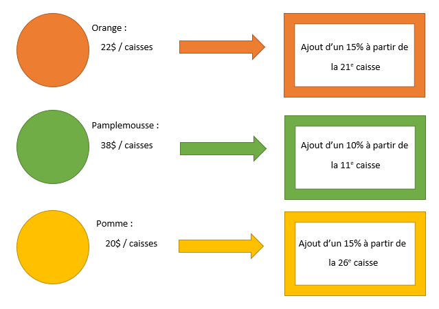
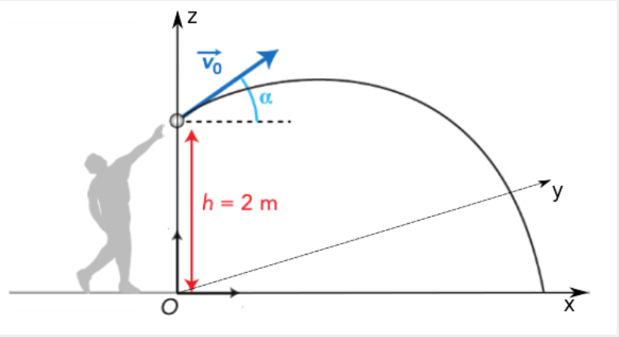

class: title-slide, middle

<style type="text/css">
  .title-slide {
    background-image: url('assets/img/Coding.png');
    background-color: #23373B;
    background-size: contain;
    border: 0px;
    background-position: 600px 0;
    line-height: 1;
  }
</style>

# Bienvenue à l'atelier 2

<hr width="65%" align="left" size="0.3" color="orange" ></hr>

## Écrire des fonctions avec R

<hr width="65%" align="left" size="0.3" color="orange" style="margin-bottom:40px;" alt="@Martin Sanchez"></hr>

.instructors[
  ***ALÉA R*** - Antoine Bergeron
]

</img>


---
class: middle, center, inverse

# Opérations mathématiques de base

<hr width="65%" size="0.3" color="orange" style="margin-top:-20px;"></hr>

---

# Générer des nombres aléatoires

Il peut souvent être pratique de générer des chiffres au hasard, sur lesquels on souhaite faire des tests. Nous verrons plusieurs exemples dans les capsules de l'atelier 3, mais pour l'instant, prenez note de la fonction suivante:

```{r}
alea <- runif(n = 10, min = 0, max = 1)
alea
```
Ici la distribution utilisée est la distribution uniforme, toutes les autres distributions en sont dérivées.

`alea` contient maintenant 10 valeurs entre 0 et 1. Une caractéristique importante à propos de la loi uniforme est que la probabilité d'obtenir n'importe chiffre entre la valeur min et max est la même.

---

# Opérateurs de base

R peut faire toutes les opérations mathématiques de base d'une calculatrice :

<b>Addition</b>
```{r}
3 + 7
```

<b>Soustraction</b>
```{r}
3 - 7
```

---

# Opérateurs de base

R peut faire toutes les opérations mathématiques de base d'une calculatrice:

<b>Multiplication</b>
```{r}
3 * 7
```

<b>Division</b>
```{r}
3 / 7
```

---

# Opérateurs de base

R respecte la priorité des opérations, tel que démontré par l'exemple suivant:

```{r}
3 + 7 / 2 * 5
3 + (7 / 2) * 5
```

---

# Opérations sur des vecteurs et matrices

Par défaut, le produit de vecteurs et de matrices est *scalaire* :

```{r}
vec1 <- c(1,2,3,4,5)
vec1
2*vec1
```

---

# Opérations sur des vecteurs et matrices

La situation plus compliquée survient lorsque l'on multiplie des vecteurs et des matrices :

```{r}
vec1 <- c(10,20,30)
mat1 <- matrix(c(1:6), nrow = 3, ncol = 2)
mat1
vec1 * mat1

```

---

# Opérations sur des vecteurs et matrices (suite)

Sur R, il suffit que la longueur de notre vecteur équivaut au nombre de colonnes ou de lignes de la matrice pour que l'opération soit valide. Dans les deux cas, chaque élément du vecteur multiplie les éléments de la matrice dans l'ordre des colonnes.

```{r}
vec1 <- c(10,20,30)
mat2 <- matrix(c(1:6), nrow = 2, ncol = 3)
mat2
vec1 * mat2

```

---

# Opérations avancées

<b>Logarithme en base 10</b>
```{r}
log10(100)
log(100, base = 10)
```

<b>Logarithme népérien</b>
```{r}
log(100)
```


---
# Opérations avancées

<b>Fonction exponentielle</b>
```{r}
exp(4.60517)
exp(10)
```

---


# Opérations avancées

<b>Exposant</b>
```{r}
10^2
```

<b>Racine carrée</b>
```{r}
sqrt(100)
```

---

# Opérations avancées

<b>Minimum et maximum</b>
```{r}
alea <- runif(10,0,1)
alea
min(alea)
max(alea)
```

---

# Opérations avancées

<b>Arrondir</b>
```{r}
pi
floor(pi)
ceiling(pi)
round(pi,4)
```

---

# Opérations sur des matrices

Parfois, on souhaite calculer des propriétés sur des colonnes et des rangées:

```{r}
mat <- matrix(runif(4,0,1), nrow = 2, ncol = 2)
mat
rowSums(mat)
colSums(mat)
```

---

# Opérations sur des matrices

Et de façon plus générale, on peut utiliser la fonction `apply()` qui est très pratique :

```{r}
mat
apply(X = mat, MARGIN = 1, FUN = sum)
apply(X = mat, MARGIN = 2, FUN = sum)
```

---

# Opérations sur des matrices

Et finalement, il est pratique de savoir que la particularité de R d'être un langage vectoriel permet de facilement faire des opérations sur les matrices :

```{r}
vec1 <- c(10,20,30)
mat1 <- matrix(c(1:6),nr = 3, nc = 2)
vec1 * mat1
vec1 %*% mat1
```

On peut donc multiplier des matrices en utilisant l'opérateur `%*%`

---
class: middle, center, inverse

# Exercices
<hr width="65%" size="0.3" color="orange" style="margin-top:-20px;"></hr>

---

#Exercice 1: Coût d'une famille par année

Calculer d'abord les fonctions suivantes:

(A) $log_2(57)$    (B) $exp(ln(4.1))$    (C) $2^2\cdot \sqrt{1/3}$ 

1. Arrondisser la fonction (A). Arrondisser ensuite à la baisse la fonction (B). Arrondisser finalement à la hausse la fonction (C).
2. Le nombre obtenu en (1) représente le nombre d'enfants qu'une famille souhaite avoir. Créer un vecteur regroupant les trois résultats.
3. Parmi les trois familles, quel est le nombre maximal d'enfants qu'une famille souhaite avoir?
4. Les familles (A), (B) et (C) habitent respectivement en Estrie, Montérégie et Mauricie. Sachant que le coût de vie d'un enfant est de 10000*$/*années en Estrie, 12000*$/*années en Montérégie et 11500*$/*années en Mauricie, combien devront débourser chaque famille par année en supposant que leur nombre d'enfants attendu devient réel?

---

class: inverse, middle, center

# Mettre sur pause
<hr width="65%" size="0.3" color="red" style="margin-top:-20px;"></hr>

---

# Solutions 1 et 2

```{r}
res_A <- log(57, base = 2)
res_B <- exp(log(4.1))
res_C <- 2^2 * sqrt(1/3)
nouv_res_A <- round(res_A)
nouv_res_B <- floor(res_B)
nouv_res_C <- ceiling(res_C)
enfants <- c(nouv_res_A,nouv_res_B,nouv_res_C)
```

0 - `res_A`, `res_B` et `res_C` représentent les résultats de chaque équation: 5.83289, 4.1 et 2.30940

1 - `nouv_res_A`, `nouv_res_B` et `nouv_res_C` représentent les résultats arrondis: 6, 4 et 3

2 - `enfants` représente le vecteur du nombre d'enfants attendu par famille. [6,4,3]

---

# Solution 3 et 4


```{r}
enfants_max <- max(enfants)
cout_vie <- c(10000,12000,11500)
montant <- enfants * cout_vie
```

3 - `enfants_max` représente la valeur maximale du vecteur `enfants`: [6]

4 - On crée d'abord le vecteur du coût de la vie `cout_vie`. On calcule ensuite `montant` qui représente le nombre d'enfants multiplié par le coût de la vie dans chacune des régions respectives.


---

# Exercice 2: Abondances relatives

Au moyen du fichier [party.csv](./donnees/party.csv), je vous demande de faire les opérations suivantes:

1. Calculer le nombre total d'enfants ayant bu chaque type de boisson gazeuse. 
2. Calculer le nombre d'enfants présent à la fête.
3. Calculer en fonction des sacs de croustille le nombre moyen d'enfants par type de liqueur. 
4. Calculer le coefficient de variation. (Écart-type/Moyenne avec sd() et mean())
5. Calculer le nombre total d'enfants ayant mangé chaque sorte de croustille.
6. Transformer les valeurs du tableau afin d'obtenir le pourcentage d'enfants ayant mangé chaque sorte de croustille (avec 2 décimales de précision).

---

class: inverse, middle, center

# Mettre sur pause
<hr width="65%" size="0.3" color="red" style="margin-top:-20px;"></hr>

---

# Solutions 1, 2, 3 et 4

```{r}
party <- read.table(file="./donnees/party.csv", header=TRUE, sep = ";", row.names = 1)
Enf_total_col <- apply(party, 2, sum)
Enf_total <- sum(Enf_total_col)
Enf_moyen_col <- apply(party, 2, mean)
Enf_sd_col <- apply(party, 2, sd)
Enf_cv <- (Enf_sd_col/Enf_moyen_col)
```

1 - `Enf_total_col`: Total du nombre d'enfants par colonne: [131, 113, 103, 73, 80]

2 - `Enf_total`: Total du nombre d'enfants: [500]

3 - `End_moyen_col`: Moyenne par ligne du nombre d'enfants pour chaque colonne: [8.19, 7.06, 6.44, 4.56, 5]

4 - `Enf_cv`: Coefficient de variation par colonne: [1.153, 0.602, 0.494, 0.698, 0.641]
---

# Solutions 5 et 6

```{r}
Enf_total_lig <- apply(party, 1, sum)
party_rel_crou <- round(party/Enf_total_lig, 2)
head(party_rel_crou)
```

5 - `Enf_total_lig`: Total du nombre d'enfants par ligne: (16 résultats débutant par [21, 74, 49, 19, ...])

6 - `party_rel_crou`: Le tableau au dessus nous indique le pourcentage relatif à chaque ligne.

---
class: middle, center, inverse

# Les fonctions
<hr width="65%" size="0.3" color="orange" style="margin-top:-20px;"></hr>

---

# Qu'est-ce qu'une fonction ?

Une fonction contient une série de commandes (i.e. lignes de code) qui sont exécutées lorsque la fonction est appelée.

---

# Un simple exemple

```{r eval=FALSE}
ma_fonction <- function(argument1, argument2) {

  # Ce que l'on veut que la fonction exécute
  resultat <- argument1 * argument2

  # Optionnel. Si l'on veut accéder au résultat de la fonction
  return(resultat)
}
```

---

# Pourquoi utiliser des fonctions ?

1. Répéter une même tâche mais en changeant ses paramètres
2. Rendre votre code plus lisible
3. Rendre votre code plus facile à modifier et à maintenir
4. Partager du code entre différentes analyses
5. Partager votre code avec d'autres personnes
6. Modifier les fonctionnalités par défaut de R

---

# La construction d'une fonction

Imaginons que l'on souhaite multiplier deux chiffres (disons, 3 et 7) et les diviser par leur somme.

$$
\dfrac{3\times7}{3+7}
$$

On peut écrire ce calcul directement dans la console comme suit

```{r}
(3*7)/(3+7)
```

---

# La construction d'une fonction

Si on souhaite faire la même opération pour toutes les pairs de chiffres dans le tableau suivant, comment fait-on ?

```{r}
tableau <- data.frame(x=rnorm(5),y=rnorm(5))
tableau
```

*Note: on voit ici apparaître la fonction `rnorm`. Cette fonction renvoie un vecteur de valeurs aléatoirement distribué selon une loi normale. Par défault, `mean` vaut 0 et `sd` vaut 1. La valeur 5 équivaut au nombre de valeurs dans le vecteur que l'on souhaite obtenir.

---

# La construction d'une fonction

À noter qu'en ayant différents chiffres, la formule vue dans la diapositive 31/53 devient un peu plus générale :

$$
\dfrac{x\times y}{x+y}
$$

---

# La construction d'une fonction

## L'approche longue, pas efficace, mais qui marche...

```{r, results="hold"}
(tableau[1,1]*tableau[1,2])/(tableau[1,1]+tableau[1,2])
(tableau[2,1]*tableau[2,2])/(tableau[2,1]+tableau[2,2])
(tableau[3,1]*tableau[3,2])/(tableau[3,1]+tableau[3,2])
```

**Problème** - Ce n'est vraiment pas pratique si on a beaucoup de données ou si le format du tableau change.

---

# La construction d'une fonction

## Une boucle peut sauver du temps...

```{r}
for(i in 1:nrow(tableau)){
  res <- (tableau[i,1]*tableau[i,2])/(tableau[i,1]+tableau[i,2])
  print(res)
}
```

**Problème** - Qu'est-ce qu'on fait si on veut appliquer ce calcul sur plusieurs tableaux ???
*C'est possible, mais ça peut être un peu plus compliqué !*

---

# La construction d'une fonction

## Et si on faisait une fonction...

La fonction permet de résoudre certains problèmes car elle permet d'appliquer une série de commandes (i.e. lignes de codes) à différents types de données. En d'autre mots, la fonction généralise des commandes spécifiques.

---

# La construction d'une fonction

## Comment construire une fonction ?

On commence par écrire une version spécifique du code que l'on souhaite **généraliser**.

```{r,eval=FALSE}
(3*7)/(3+7)
```

---

# La construction d'une fonction

## Comment construire une fonction ?

Ensuite, on définit ce code comme faisant parti d'une fonction.

```{r}
prodsum <- function(){
  res <- (3*7)/(3+7)
  return(res)
}
```

*Yééé, on a écrit notre première fonction !! :-)*

```{r}
prodsum()
```

---

# Petit problème

Cette fonction a le défaut de n'être aucunement générale. Elle va toujours donner le même résultat. *:-(*

---

# Comment construire une fonction ?

À noter qu'en utilisant la commande `return()`, on s'assure de renvoyer ce qui se trouve dans l'objet `res` à l'utilisateur.

Une notion importante à savoir lorsqu'on construit une fonction est que tout ce qui se trouve à l'**intérieur** d'une fonction est *entièrement* indépendent de ce qui se trouve à l'**extérieur** d'une fonction.

Par exemple, l'objet `res` à l'extérieur de la fonction **n'existe pas**. Il a un sens uniquement à l'intérieur de la fonction.


---

# Comment rendre la fonction plus générale ?

On peut généraliser cette fonction, en implémentant directement la formule générale présentée précédemment:

$$
\dfrac{x\times y}{x+y}
$$

Pour ce faire, il faut ajouter des **arguments** à notre fonction.

---

# Comment rendre la fonction plus générale ?

Les **arguments** peuvent varier selon ce que l'utilisateur souhaite calculer. Il faut donc s'assurer que les mêmes opérations soient réalisées sur ces arguments.

```{r}
prodsum <- function(x,y){
  res <- (x*y)/(x+y)
  return(res)
}
```

Avec cette fonction on peut faire le calcul qui nous intéresse avec différentes séries de chiffres.

---

# Comment rendre la fonction plus générale ?

Autre caractéristique importante des arguments d'une fonction: les objets passés en argument n'ont pas besoin d'avoir le même nom que les arguments. En fait, c'est rarement le cas :

```{r}
a <- 1
b <- 2
prodsum(x = a, y = b)
```

---

# Utilisons notre fonction avec des chiffres

```{r}
prodsum(x = 3, y = 7)
prodsum(3, 7)
prodsum(y = 7, x = 3)
```

Comme on le constate, dans le langage R, les arguments peuvent être définis de deux façons.
- En suivant l'ordre des arguments
- En utilisant le noms des arguments

---

# Utilisons notre fonction avec des vecteurs

Le langage de programmation R permet de faire aussi le calcul sur des vecteurs :

```{r}
vecA <- tableau[,1]
vecB <- tableau[,2]
prodsum(vecA, vecB)

prodsum(tableau[,1], tableau[,2])
```

---

# Utilisons notre fonction avec des vecteurs

L'exemple précédent fonctionne bien, car `vecA` et `vecB` contiennent le même nombre de chiffres. Ils ont donc la même longueur. Que ce passe-t-il si les vecteurs n'ont pas la même longueur?

```{r}
vec2 <- tableau[1:2,1] #longueur 2
vec3 <- tableau[1:3,1] #longueur 3
vec4 <- tableau[1:4,2] #longueur 4
prodsum(vec3, vec4)
```

---

# Utilisons notre fonction avec des vecteurs (suite)


```{r}
prodsum(vec2, vec4)
```

---


# La construction d'une fonction

Le **recyclage** est une propriété des fonctions mathematiques de base du langage R (e.g. `+`, `-`, `*` et `/`). Lorsque deux vecteurs sont de longueurs différentes, les valeurs du vecteur le plus court sont réutilisées **dans l'ordre** pour combler le nombre de valeurs manquantes entre les deux vecteurs. Cette propriété du langage R peut être très pratique mais aussi **générer beaucoup de problèmes**.

Comme on le voit dans l'exemple, un message d'avertissement est envoyé si la longueur du plus petit vecteur n'est pas un multiple du vecteur le plus long. Par contre, si le vecteur le plus court est un multiple du vecteur le plus long, aucun message d'avertissement n'est envoyé, et ce, même si le résultat n'a pas de sens.

Comment faire pour régler ce problème ?

---

# Ajouter des trappes dans une fonction

Pour régler le problème subtile présenté dans la diapositive précédente, on peut ajouter des conditions de sortie dans la fonction qui retournent un message d'erreur. Voici un exemple :

```{r}
prodsum <- function(x, y){
  if(length(x) != length(y)){
    stop("'x' est de taille différente de 'y'")
  }
  res <- (x*y)/(x+y)
  return(res)
}
```

Les lignes de codes ajoutées mesurent la longueur de `x` et `y` et lorsqu'ils sont d'une longueur différente, un message d'erreur est envoyé et le reste du code dans la fonction n'est pas évalué.

---

# Ajouter des trappes dans une fonction

La condition de sortie `stop("'x' est de taille différente de 'y'")` permet de corriger notre problème:

```{r, error=TRUE}
prodsum(vec2,vec4)
prodsum(vec3,vec4)
```

Le message d'erreur est alors composé par le programmeur et représente ce qui se trouve dans `stop()`. Il est important que le message d'erreur soit court et précis.

---

# Utilisons notre fonction avec des tableaux

Le langage de programmation R permet de faire aussi le calcul sur des matrices

```{r}
tableau2 <- data.frame(x_2=rnorm(5)^2,y_2=rnorm(5)^2)
prodsum(tableau, tableau2)
```

---

# La sortie

Une fonction peut réaliser plusieurs opérations avec les mêmes éléments d'entrée et on peut souhaiter retourner ces arguments dans une liste :

```{r}
ma_fonction <- function(x) {

  # Calcul de la moyenne
  res1 <- mean(x)

  # Calcul de l'écart-type
  res2 <- sd(x)

  # Calcul du coefficient de variation
  res3 <- res2/res1

  # On regroupe les résultats dans une liste
  final = list(moyenne = res1, ecart_type = res2, CV = res3)

  # Et on retourne le tout hors de la fonction
  return(final)
}
```

---

# La sortie

Une fonction peut réaliser plusieurs opérations avec les mêmes éléments d'entrée et on peut souhaiter retourner ces arguments dans une liste :

```{r}
test <- ma_fonction(rnorm(n = 100, mean = 1, sd = 0.5))
test
```

---

# Règles utiles lorsqu'on construit une fonction
  - Tout ce qui se trouve à l'intérieur d'une fonction est **entièrement** indépendent de ce qui se trouve à l'extérieur de cette fonction ;
  - Donner un nom représentatif à la fonction qui résume ce qu'elle fait ;
  - Tous les arguments de la fonction doivent être utilisés;
  - Les arguments doivent aussi avoir des noms représentatifs ;
  - Commentez les étapes du code ;
  - Prenez le temps de décrire les arguments sous forme de commentaires en début de fonction ;

---
class: inverse, center, middle

# Exercices
<hr width="65%" size="0.3" color="orange" style="margin-top:-20px;"></hr>

---

# Ex 1: La chimie des solutions "mathématiques"

Roger est un apprenti chimiste. (Et nous verrons bientôt qu'il est aussi un apprenti programmeur, contrairement à vous!) À chaque jour, Roger effectue la même expérience. Au bout d'un an, il possède alors 365 données contenant trois variables: la masse en grammes de carbone recueilli, le volume de sa solution en litre ainsi que le pH de sa solution. Ces données sont disponibles ici: [chimie.csv](./donnees/chimie.csv). Il souhaite maintenant calculer la concentration molaire (molarité) moyenne de ces expériences sur le carbone. Les formules à utiliser par Roger sont présentées à la diapositive suivante. 

<div style='text-align:center;'>
</img>
</div>

---

# Ex 1: suite

$n = \dfrac{m}{M}$ où m représente la masse (g), n représente le nombre de moles (mol) et M représente la masse molaire (g/mol)

$C = \dfrac{n}{V}$ où V représente le volume de solution (L) et C la concentration molaire (mol/L)

Roger m'informe qu'il pensait calculer ses 365 concentrations molaires à bras. En échange d'un morceau de robot, vous lui proposez de vous en occuper à l'aide d'une fonction. Acceptant avec joie, il vous affirme que la masse molaire du carbone est une constante de valeur 12.011 (g/mol) avant de vous laisser.

<div style='text-align:center;'>
</img>
</div>

---

class: inverse, middle, center

# Mettre sur pause
<hr width="65%" size="0.3" color="red" style="margin-top:-20px;"></hr>

---

# Solution de l'exercice 1

```{r}
roger_tab <- read.table(file = './donnees/chimie.csv', sep=";", header = TRUE)

concen_carb <- function(m,V){  # m représente la masse, V le volume. 
                               # Notons que même si le pH est donné, il n'est pas 
                               # nécessaire et n'apparait donc pas dans les arguments de la fonction.
  M <- 12.011 # La valeur M est une constante.
  n <- m/M # Premier calcul pour trouver la valeur de n.
  C <- n/V # Deuxième calcul à partir du n afin de trouver la valeur du C.
  return(C) # On retourne la valeur d'intérêt (la concentration molaire).
}
# La fonction est maintenant crée! Suffit maintenant de remplacer par les valeurs 
# "m" et "V" qui se situe dans la première et deuxième colonne de notre tableau importé.

result <- concen_carb(roger_tab[,1],roger_tab[,2]) # result possède les 365 concentrations 
                                                   # issues des 365 appels de la fonction (une par ligne).
mean(result) #On s'intéressait à la moyenne des concentrations!
```

---

# Ex 2: Le voyage humanitaire d'Alexis

Alexis vend des pommes, des oranges et des pamplemousses dans le but de participer à un voyage humanitaire. Présentement, il calcule son montant total à l'aide d'une calculatrice. Cependant, il doit recalculer à chaque jour son total amassé et aimerait avoir une fonction qui lui permettrait de l'obtenir directement, en fonction du nombre de caisse de pommes, d'oranges et de pamplemousses vendus. Présentement, il a vendu un total de 6 caisses de pamplemousses, 21 caisses d'oranges et 14 caisses de pommes. À la diapositive qui suit, Alexis a eu la gentillesse de nous faire un tableau expliquant les prix.

---

# Ex 2: suite

<div style='text-align:center;'>
</img>
</div>

Quel est le montant total amassé par Alexis en ce moment?

---

class: inverse, middle, center

# Mettre sur pause
<hr width="65%" size="0.3" color="red" style="margin-top:-20px;"></hr>

---

# Solution de l'exercice 2

```{r}
montant_total_v1 <- function(nbOr,nbPo,nbPa){  
  if(nbOr > 20){
    montant_or <- (20 * 22) + ((nbOr - 20) * 22 * (1 + 0.15))
  } else {
    montant_or <- nbOr * 22
  }
  if(nbPo > 25){
    montant_po <- (25 * 20) + ((nbPo - 25) * 20 * (1 + 0.15))
  } else {
    montant_po <- nbPo * 20
  }
  if(nbPa > 10){
    montant_pa <- (10 * 38) + ((nbPa - 10) * 38 * (1 + 0.10))
  } else {
    montant_pa <- nbPa * 38
  }
  montant_total <- sum(montant_or,montant_po,montant_pa)
  return(montant_total)
}

```

---

# Solution de l'exercice 2

```{r}
montant_total_v2 <- function(nbOr,prixOran,borneOran,pourcOran,nbPo,prixPomm,bornePomm,pourcPomm,nbPa,prixPamp,bornePamp,pourcPamp){  
  if(nbOr > borneOran){
    montant_or <- borneOran * prixOran + (nbOr - borneOran) * prixOran * (1 + pourcOran)
  } else {
    montant_or <- nbOr * prixOran
  }
  if(nbPo > bornePomm){
    montant_po <- bornePomm * prixPomm + (nbPo - bornePomm) * prixPomm * (1 + pourcPomm)
  } else {
    montant_po <- nbPo * prixPomm
  }
  if(nbPa > bornePamp){
    montant_pa <- bornePamp * prixPamp + (nbPa - bornePamp) * prixPamp * (1 + pourcPamp)
  } else {
    montant_pa <- nbPa * prixPamp
  }
  montant_total <- sum(montant_or,montant_po,montant_pa)
  return(montant_total)
}

```
---

# Solution de l'exercice 2: (suite)

```{r}
montant_total_v1(21,14,6)
montant_total_v2(21,22,20,0.15,14,20,25,0.15,6,38,10,0.10)
```

On remarque que beaucoup d'arguments ont été utilisé pour notre fonction `montant total_v2`. Gardez en tête qu'effectivement, le temps mis sur l'écriture de la fonction semblera habituellement beaucoup plus long que d'utiliser la calculatrice. Remarquons que j'utilise tout mes arguments dans ma fonction. Remarquons aussi que si Alexis m'indiquait qu'une semaine plus tard, il était rendu à 27 caisses d'oranges, 23 caisses de pommes et 13 caisses de pamplemousses vendus et que le tableau précédent avait changé pour celui-ci:

---

# Solution de l'exercice 2: (suite)

<div style='text-align:center;'>
</img>
</div>

On arriverait très simplement à calculer le montant total d'Alexis.

---

# Solution de l'exercice 2: (suite)

Il suffirait de changer le nombre de caisses pour chaque type de fruit ainsi que les trois éléments surlignés en cyan.

```{r}
# montant_total_v2(21,22,20,0.15,14,20,25,0.15,6,38,10,0.10) initial
  montant_total_v2(27,22,20,0.20,23,20,17,0.15,13,42,10,0.10) # avec changement
```

---

# Ex 3: Bonsoir, elle est partie!

Au baseball, la loi de la physique l'emporte toujours. On s'intéresse dans cet exercice a déterminer si la frappe d'un joueur a mené à un coup de circuit ou non. Pour qu'un coup de circuit soit réalisé, il faudra que la distance verticale de la balle avec le sol à 100 mètres de distance horizontale soit plus grande que 3 mètres. Voici une image représentative des variables que nous devons connaître afin d'effectuer nos calculs.

<div style='text-align:center;'>
</img>
</div>

---

# Ex 3: suite

Les éléments importants sont les suivants: la vitesse initiale de la balle après le contact du bâton ( $v_0$ ), l'angle de la frappe en radian ( $\alpha$ ) ainsi que la hauteur du bâton au contact de la balle. Remarquons qu'une balle lancée dans les air redescend toujours! C'est à cause de l'accélération de la pesanteur, une valeur constante de 9.81 $m/s^2$ (g). Voici les statistiques de 5 frappeurs (vitesse de la balle/angle en radian/hauteur du bâton):

(35/1/1.5), (32.5/1.15/1.52), (35.5/1.12/1.56), (27.1/1.9/1.45), (42.1/0.6/1.51)

Nous pourrons alors calculer la distance verticale avec le sol à 100m de distance horizontale à l'aide de la fonction suivante:

$y = \dfrac{-5000g}{cos^2(\alpha)v_0^2} + 100tan(\alpha) + h$

Notons que les fonctions `cos()` et `tan()` sur R sont définies pour des angles en radians.

---

# Ex 3: suite

1. Créez une fonction qui retourne la hauteur de la balle à 100m.
2. Créer une matrice 5x3 contenant les informations des frappeurs. 
3. Finalement, à l'aide d'un pseudo-code, écrivez la marche à suivre afin d'obtenir les informations suivantes pour chaques frappeurs: La hauteur de la balle à 100m de distance horizontale et la phrase que l'analyste sportif à la télévision a utilisé.

Si la distance verticale est supérieur à 10, l'animateur hurle: `Bonsoir, elle est partie!` Si la balle est à une distance verticale supérieur à 0, mais inférieur ou égale à 10, l'animateur se contente d'affirmer: `C'est un coup sûr!` Pour une distance verticale négative, on souhaite retourner la valeur 0 ainsi que la phrase: `Retirer!`

---

class: inverse, middle, center

# Mettre sur pause
<hr width="65%" size="0.3" color="red" style="margin-top:-20px;"></hr>

---

# Solution de l'exercice 3

```{r}
hauteur_balle <- function(v,a,h){
  g <- 9.81
  y <- (-5000*g)/(cos(a)^2 * v^2) + 100*tan(a) + h
  return(y)
}
```

```{r}
donnees <- matrix(c(35,32.5,35.9,27.1,42,1,1.15,1.12,1.9,0.6,1.5,1.52,1.56,1.45,1.51), nrow = 5, ncol = 3)
donnees
```

---

# Solution de l'exercice 3: (suite)


```
dist_vert <- baseball(v = donnees[,1],a = donnees[,2], h = donnees[,3])

FOR i IN 1:nrow(donnees)
  IF dist_vert > 10
    TEXTE[i] <- "Bonsoir, elle est partie!"
  ELSEIF 0 < dist_vert <= 10
    TEXTE[i] <- "C'est un coup sûr!"
  ELSE
    dist_vert <- 0
    TEXTE[i] <- "Retirer!"
  END IF
END FOR

res_final <- cbind(dist_vert,TEXTE)
```


---

# Exercice récapitulatif

Dans cette exercice récapitulatif, nous travaillerons à partir de deux fichiers contenant différentes statistiques de 50 joueurs de soccer.

[soccer.csv](./donnees/soccer.csv) : Statistiques de 50 joueurs de soccer professionnels.

[minjoue.csv](./donnees/minjoue.csv) : Statistiques sur le temps de jeu des joueurs sur 20 parties.

Pour cet exercice, nous nous intéresserons à déterminer la valeur actuelle d'un joueur de soccer, c'est-à-dire la valeur pour laquelle il pourrait être échangé sur le marché des transactions.

La valeur d'un joueur sera calculé à l'aide des quatre critères suivants: l'âge, la valeur du contrat actuel, son poste ainsi que ces performances.

---

# Exercice récapitulatif (suite)

À l'aide de calcul savant, nous avons pu déterminer que la valeur actuelle d'un joueur de soccer était obtenue de la façon suivante:

$Val = (-0.05(x_1 - 30)^2 + 7.5) + (x_2 + \dfrac{5}{100}\cdot x_2) + x_3^*$

$\hspace{4cm} + ( 0.75\cdot x_4 + 0.55 \cdot x_5 + \dfrac{1}{30}\cdot x_6)$

où $x_1$ représente l'âge du joueur, $x_2$ la valeur du contrat, $x_3^*$ la valeur du poste, $x_4$ le nombre de buts, $x_5$ le nombre de passe décisive ainsi que $x_6$ le nombre moyen de minutes jouées par partie. 

Notons que $x_3^*$ vaut 2 pour un attaquant, 3 pour un milieu de terrain ou un gardien et 4 pour un défenseur. Ces valeurs sont inscrites dans la $7^e$ colonne du fichier `soccer.csv`.

---

# Exercice récapitulatif (suite)

Après avoir visionné le tableau des statistiques, on remarque que le nombre de minutes moyennes par match n'est pas déterminer. À l'aide du deuxième tableau, trouvez la moyenne du temps de jeu pour chaque joueur (vecteur). Remplacer ensuite la $6^e$ colonne du premier tableau par votre vecteur obtenu.

1. Calculez le coefficient de variation du nombre de buts marqué
2. Identifiez quel joueur possède le plus de points (buts + passes) à l'aide de la fonction `which.max()`
3. En regardant vos données suite à la question 2, quel est le défaut de la fonction `which.max()`?
4. Créez une fonction qui permet de calculer la valeur actuelle d'un joueur
5. Appliquez cette fonction sur l'ensemble des joueurs.
6. Quelle est la valeur actuelle du joueur la plus élevée?

