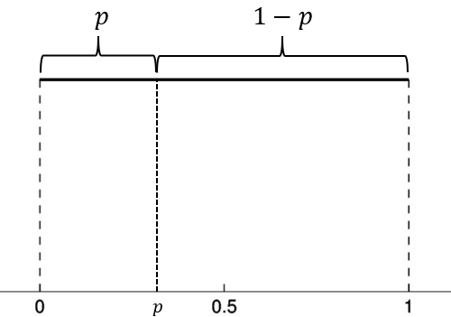

class: title-slide, middle

<style type="text/css">
  .title-slide {
    background-image: url('assets/img/Coding.png');
    background-color: #23373B;
    background-size: contain;
    border: 0px;
    background-position: 600px 0;
    line-height: 1;
  }
</style>

# Bienvenue à l'atelier 3

<hr width="65%" align="left" size="0.3" color="orange"></hr>

## Algorithmique 

<hr width="65%" align="left" size="0.3" color="orange" style="margin-bottom:40px;" alt="@Martin Sanchez"></hr>

.instructors[
  ***ALÉA R*** - Antoine Bergeron
]

</img>


---
class: inverse, middle, center

# Les boucles
<hr width="65%" size="0.3" color="orange" style="margin-top:-20px;"></hr>

---

# Mise en situation

Vous étudiez la démographie de la population humaine sur la planète Terre. Vos données sont très simples, vous avez deux pays dont vous connaissez la talle de la population au 1er janvier 1988, 1989, 1990, 1991, 1992, 1993 et 1994. Vous devez vérifier si la population est en croissance, stable ou en déclin sur cette séquence de 7 ans. Le taux de croissance est donné par l'équation suivante:


$$\lambda_{t+1} = \dfrac{N_{t+1} - N_t}{N_t}$$

---

# Mise en situation

Les données (en millions d'habitants) ressemblent à ce qui suit:

```{r}
donnees <- matrix(nr = 7, nc = 2)
donnees[,1] <- c(11.1,11.4,11.8,12.1,12.5,12.9,13.2) #Cameroun
donnees[,2] <- c(7.1,7.3,7.3,7.1,6.7,6.3,5.9) #Rwanda
an <- c(1988:1994)
head(donnees)
```

---

# Mise en situation

Les données ressemblent à ce qui suit:

```{r, out.width = '42%', dpi=300, fig.align="center"}
plot(an,donnees[,1],type = "l", xlab = "Année",ylab = "Nombre d'individus", ylim=c(3,30),cex=2)
lines(an,donnees[,2], lty = 3)
```

---
# Mise en situation

Maintenant, on doit calculer le taux de croissance annuel pour chaque pays. Commençons pour l'intervalle entre l'an 1988 et l'an 1989 pour le Cameroun :

```{r}
lambda <- matrix(nrow = 6, ncol = 2)
lambda[1,1] <- (donnees[2,1] - donnees[1,1]) / donnees[1,1]
```

Ensuite, on fait pour la période de 1989 à 1990 :

```{r}
lambda[2,1] <- (donnees[3,1] - donnees[2,1]) / donnees[2,1]
```

---
# Mise en situation

Très rapidement, on réalise que c'est assez fastidieux de refaire cet exercice à la main, mais c'est faisable. (12 calculs pour 2 pays et 7 années)

Imaginez cependant qu'on vous demande d'effectuer une étude similaire sur l'ensemble de tous les pays dans le monde, sur une période de 50 ans. Le nombre de calculs à effectuer deviendrait alors beaucoup trop élevé pour être effectué à la main. Il faudra alors changer de technique....

---
# Mise en situation

Dans les capsules de l'atelier 2, nous avons vu comment généraliser une séquence d'opérations au moyen d'une fonction. Comment est-ce qu'on peut généraliser des opérations qui sont répétées très souvent ? C'est le principe de la boucle.

---
# Définition

Une boucle est une commande qui permet de répéter une série d'instructions sous des conditions définies de départ et de fin. C'est une commande de base de l'algorithmique.

---
# Anatomie de la boucle

```{r}
depart <- 1
fin <- 5
for(etape in depart:fin) {
    print(etape)
}
```

L'exécution une fois d'un groupe de commandes dans une boucle s'appelle une itération.

---
# Quelques exemples simples

On peut mettre toutes sortes de contraintes sur l'index de la boucle

```{r}
for(etape in c("Bonjour", "programmeurs", "en R")) {
    print(etape)
}
```

Dans cet exemple, notre séquence contient 3 éléments "Bonjour", "programmeurs", "en R". R va évaluer l'expression 3 fois. La variable index, ici `etape`, prendra successivement les valeurs de 1 à 3 pendant l'exécution de la boucle.

---
# Quelques exemples simples

Par défaut, R augmente toujours l'index de 1 unité

```{r}
for(etape in 1:5) {
    print(etape*2)
}
```

---
# Exercice

Transformez en fahrenheit une séquence de température en celsius qui va de -50 à 100, par bond de 1. Rappelez vous que la conversion est $1.8*C + 32$.

- Déterminez le point de départ de la séquence
- Déterminez le point de fin de la séquence
- Faites le calcul approprié

---
# Exercice

```{r}
for(C in -50:100) {
    cat("Pour C = ",C," on obtient F = ",1.8*C + 32, '\n')
}
```

---
# Boucles et indexation

Les boucles sont souvent utilisées pour accéder à des positions dans un objet de façon récursive. La variable de la boucle peut alors être utilisée directement comme index pour accéder à l'objet. Par exemple :

```{r}
test = runif(5, 0,1)
for(etape in 1:5) {
    print(test[etape])
}
```

---
# Boucles et indexation

De même, on peut réaliser des opérations mathématiques sur cette variable

```{r}
for(etape in 1:8) {
    cat("À l'étape", etape, ", la boucle est complétée à", etape/8*100, "%.", '\n')
}
```

---
# Compteur

La séquence ne commence pas toujours par 1, et donc parfois on doit avoir un compteur indépendent pour l'indexation. Il est donc pratique de calculer à quelle position on se situe dans la boucle.

```{r}
n = 1
for(etape in -2:5) {
    cat("etape = ",etape, " n = ",n, '\n')
    n <- n + 1
}
```

---
# Exercice

Enregistrez les résultats de votre conversion de température dans une matrice ayant pour première colonne la valeur en Celcius et pour deuxième colonne la valeur en Fahrenheit.

---
# Solution

```{r  eval=FALSE}
resultat = matrix(nrow = 151, ncol = 2)
colnames(resultat) = c("C", "F")
n = 1
for(C in -50:100) {
    resultat[n,1] = C
    resultat[n,2] = 1.8*C + 32
    n = n + 1
}
head(resultat)
```

---
# Exercice

On peut aussi utiliser le compteur pour réaliser des opérations mathématiques récursives. Par exemple, la factorielle n! est définie comme :

$$
n! = 1 \times 2 \times 3 \times 4 \times .... n
$$

Calculez la factorielle 10 au moyen d'une boucle.

---
# Solution

```{r}
n <- 1
for(etape in 1:10) n <- n*etape
n
```

---
# On complexifie le problème ....

Il est possible d'incruster une boucle dans une boucle. On réalise notamment cette opération pour faire des calculs sur des matrices, des listes...

```{r eval = FALSE}
ma_matrice <- matrix(nrow = 5, ncol = 3)
n <- 1
for(i in 1:5) {
    for(j in 1:3) {
        ma_matrice[i,j] <- n
        n <- n + 1
    }
}
ma_matrice
```

---

# Retour sur la mise en situation

Vous étudiez la démographie de la population de salamandres pourpres dans le ruisseau du massif des monts Sutton. Vos données sont très simples, vous avez une mesure d'abondance à deux points d'échantillonnage au long du ruisseau. Vous devez vérifier si la population est en croissance, stable ou en déclin sur une séquence de 5 ans. Le taux de croissance est donné par l'équation suivante :

$$
\dfrac{N_{t+1} - N_t}{N_t}
$$

On se souvient que c'est assez fastidieux de refaire cet exercice à la main, mais c'est faisable.

Imaginez cependant que vous découvrez un jour qu'un passionné des salamandres a déjà fait une étude similaire sur ce site, et par miracle vous obtenez des séries temporelles de 50 ans réparties sur 10 points d'échantillonnage. Il faudra changer de technique....

---
# Retour sur la mise en situation

La solution ressemblerait à

```{r eval=FALSE}
n_sites <- ncol(donnees)
n_annees <- nrow(donnees)
lambda <- matrix(nrow = n_annees-1, ncol = sites)
for(i in 2:n_annees) {
    for(j in 1:n_sites) {
        lambda[i-1,j] <- (donnees[i,j] - donnees[i-1,j]) / donnees[i-1,j]
    }   
}
```

---
# La boucle while

La boucle de type *while*, pour 'pendant', répète une série d'intructions tant qu'une condition n'a pas été atteinte. C'est une version générale de la boucle *for*. Par exemple, on peut tirer deux pièces de monnaie jusqu'à ce que l'on obtienne la combinaison pile-pile.

```{r}
piece <- c("pile","face")
combinaison = "face-face"
while(combinaison != "pile-pile") {
    essai1 <- sample(piece, 1)
    essai2 <- sample(piece, 1)
    combinaison <- paste(essai1, "-" , essai2, sep = "")
    print(combinaison)
}
```

---
# Exercice

Calculez en moyenne combien de fois vous avez à tirer un dé à 6 faces pour obtenir la valeur 1.

---
# Solution

```{r}
de <- c(1:6)
n_test <- 10000
res <- numeric(n_test)
for(i in 1:n_test) {
	n <- 0
	face <- 0
	while(face != 6) {
		face <- sample(de,1)
		n <- n + 1
	}
	res[i] <- n
}
mean(res)
```

---
# Solution

```{r , out.width = '50%', dpi=300, fig.align="center"}
hist(res)
```

---
class: middle, center, inverse

# Exercice intermédiaire
<hr width="65%" size="0.3" color="orange" style="margin-top:-20px;"></hr>


---
# Croissance logistique

La croissance d'une population sujette à la densité-dépendance, en temps discret, se calcul bien au moyen d'une boucle. En notant $N_t$ la densité au temps $t$, on a que la densité au temps $t+1$ se calcule ainsi :

$$
N_{t+1} = N_t + r \times N_t \times (1 - N_t/K)
$$

Henri Meunier a importé environ 220 cerfs sur l'île d'Anticosti au début du 20ème siècle et on compte aujourd'hui environ 200 000 bêtes, ce qui correspond à la capacité de support du milieu $K$. Si on fixe le taux de croissance $r$ à 0.3, combien de temps, en années, fut nécessaire à la population pour atteindre 50% de la capacité de support ?

---
# Solution 1

```{r}
r <- 0.3
N <- 220
K <- 200000
step <- 1
while(N < K/2) {
    N <- N + r * N * (1 - N/K)
    step <- step + 1
}
step
```

---
# Solution 2

```{r}
r <- 0.3
K <- 200000
n_steps <- 115
N <- numeric(n_steps+1)
N[1] <- 220

for(i in 2:(n_steps+1)) {
    N[i] <- N[i-1] + r * N[i-1] * (1 - N[i-1]/K)
}
```

---
# Solution 2

```{r, out.width = '50%', dpi=300, fig.align="center"}
plot(c(1900:2015), N, type = "l", xlab = "Année", ylab = "Population")
```


---
class: middle, center, inverse

# Expressions conditionnelles
<hr width="65%" size="0.3" color="orange" style="margin-top:-20px;"></hr>


---
# Principe

Très souvent en programmation on a à prendre des décisions du type **si la condition X est remplie, alors faire Y, sinon faire Z**. Nous avons déjà vu certains exemples depuis le début des ateliers.

La structure de base d'une expression conditionnelle est la suivante:

```{r eval = FALSE}
if(condition) {
    instruction(1)
    }
else {
    instruction(2)
}
```

---
# Arbre décisionnel

Un exemple,

```{r eval = FALSE}
test = function(jour) {
    if(jour == "lundi") {
        print("Je dois aller à l'atelier R.")
    }
    else {
        if(jour == "dimanche") {
        print("Ai-je relus les slides de la présentation de la semaine passée ?")
        }
        else {
            if(jour == "samedi") {
                print("Aujourd'hui c'est la journée gauffres!")
            }
            else {
                print("Bof, j'ai encore du temps !")
            }
        }
    }  
}
```

---
# Astuce

L'indentation (l'utilisation d'espaces dans le code) est fort utile pour s'y retrouver lorsque les conditions deviennent nombreuses. Reprenons l'exemple précédent.

---
# Astuce (comparaison)

```{r eval = FALSE}
test = function(jour) {
if(jour == "lundi") {
print("Je dois aller à l'atelier R.")
}
else {
if(jour == "dimanche") {
print("Ai-je relus les slides de la présentation de la semaine passée ?")
}
else {
if(jour == "samedi") {
print("Aujourd'hui c'est la journée gauffres!")
}
else {
print("Bof, j'ai encore du temps !")
}
}
}  
}
```

---
# Astuce (comparaison)

```{r eval = FALSE}
test = function(jour) {
    if(jour == "lundi") {
        print("Je dois aller à l'atelier R.")
    }
    else {
        if(jour == "dimanche") {
        print("Ai-je relus les slides de la présentation de la semaine passée ?")
        }
        else {
            if(jour == "samedi") {
                print("Aujourd'hui c'est la journée gauffres!")
            }
            else {
                print("Bof, j'ai encore du temps !")
            }
        }
    }  
}
```

---
# Opérateurs logiques

Les classiques :

- X est égal à Y : `X == Y` ( == )
- X est supérieur à Y : `X > Y` 
- X est inférieur à Y : `X < Y`
- X est supérieur ou égal à Y : `X >= Y` ( >= )
- X est inférieur ou égal à Y : `X <= Y` ( <= )
- X est différent de Y : `X != Y` ( != )

---
# Exercice

1. Tirez au hasard 10 chiffres entre 0 et 1.
2. Pour chacun de ces chiffres, déterminez s'il est plus petit ou plus grand que la valeur seuil de 0.3.
3. Inscrivez votre résultat dans un autre objet.

---

# Solution

.pull-left[

```{r, eval=FALSE}
X <- runif(n = 10)
res <- numeric(10)
for(i in 1:10) {
    if(X[i] < 0.3) {
        res[i] <- "plus petit"
    }
    else {
        res[i] <- "plus grand"
    }
}
cbind(X,res)
```
]

.pull-right[

```{r, echo=FALSE}
X <- runif(n = 10)
res <- numeric(10)
for(i in 1:10) {
    if(X[i] < 0.3) {
        res[i] <- "plus petit"
    }
    else {
        res[i] <- "plus grand"
    }
}
cbind(X,res)
```
]


---
# Opérateurs logiques

On peut aussi combiner plusieurs conditions :

- La condition A et la condition B : `A & B`
- La condition A ou la condition B : `A | B`

---
# Exercice

Reprenez la même séquence de chiffres, mais cette fois-ci déterminez si le chiffre est situé entre les valeurs de 0.2 et 0.6.

---

# Solution

.pull-left[

```{r, eval=FALSE}
res2 <- numeric(10)
for(i in 1:10) {
    if(X[i] > 0.2 & X[i] < 0.6) {
        res2[i] <- "oui"
    }
    else {
        res2[i] <- "non"
    }
}
cbind(X,res2)
```
]


.pull-right[

```{r, echo=FALSE}
res2 <- numeric(10)
for(i in 1:10) {
    if(X[i] > 0.2 & X[i] < 0.6) {
        res2[i] <- "oui"
    }
    else {
        res2[i] <- "non"
    }
}
cbind(X,res2)
```
]

---

# Conditions sur des vecteurs

R a la particularité d'être optimisé pour les objets sous forme de matrice ou de vecteur. Ainsi, vous pouvez évaluer des expressions conditionnelles sur un vecteur sans avoir à passer par une boucle. On peut reprendre l'exemple précédent, d'une façon beaucoup plus rapide :

.pull-left[

```{r, eval=FALSE}
res2 <- numeric(10)
res2[X > 0.2 & X < 0.6] <- "oui"
res2[X < 0.2 | X > 0.6] <- "non"
cbind(X,res2)
```
]


.pull-right[
    
```{r, echo=FALSE}
res2 <- numeric(10)
res2[X > 0.2 & X < 0.6] <- "oui"
res2[X < 0.2 | X > 0.6] <- "non"
cbind(X,res2)
```
]


---
class: middle, inverse, center

# Exercice 
<hr width="65%" size="0.3" color="orange" style="margin-top:-20px;"></hr>

---

# Le retour du scrabble ...

Vous avez tiré au hasard les lettres X = {E, Z, F, C, D}. Écrivez une fonction qui va trier vos lettres automatiquement pour vous, sans utiliser les fonctions `sort()` et `order()` de R. 

---
# Solution


```{r}
tri <- function(x){
	# Calcul de la dimension du vecteur
	taille = length(x)
	ordre = "NON"
	# Boucle qui tourne jusqu'à ce que tout soit en ordre
	while(ordre == "NON") {
		ordre = "OUI"
		# Boucle qui passe tous les éléments en paires
		for(i in 1:(taille-1)) {
			if(x[i+1] < x[i]) {
				# Inversion des deux lettres
				x[c(i,i+1)] = x[c(i+1,i)]
				# Comme un changement a été fait, l'ordre
				# n'est pas encore garanti
				ordre = "NON"
			}
		}
	}
	return(x)
}
tri(c("E", "Z", "F", "C", "D"))

```


---
class: middle, center, inverse

# Les jeux de hasard
<hr width="65%" size="0.3" color="orange" style="margin-top:-20px;"></hr>

---
# Les jeux de hasard

<div style='text-align:center;'>
</img>
</div>

---
class: middle, center, inverse

# Application 1: échantillonner un vecteur
<hr width="65%" size="0.3" color="orange" style="margin-top:-20px;"></hr>

---
# Exemple : tirer une carte au hasard

<div style='text-align:center;'>
</img>
</div>

---
# Exemple : votre jeu de cartes sur R
## La fonction `sample()`

```{r}
valeurs = c("2", "3", "4", "5", "6", "7", "8", "9", "10", "valet", "reine", "roi", "as")
couleurs = rep(c("pique", "trèfle", "carreau", "coeur"),each = 13)
cartes = paste(valeurs,"-",couleurs)
tirage = function(n, cartes) {
    sample(x = cartes, size = n, replace = FALSE)
}
tirage(3, cartes)
```

---
# Exercice

Vous trouverez les lettres du scrabble dans le fichier [lettres.txt](./donnees/lettres.txt). Vous pouvez les charger et programmer votre fonction qui vous pigera au hasard les 7 lettres pour ce jeux.

---
class: middle, center, inverse

# Application 2: échantillonner une loi de probabilité

<hr width="65%" size="0.3" color="orange" style="margin-top:-20px;"></hr>

---
# Principe

Plutôt que de tirer un élément d'une série de chiffres ou de caractères, on peut échantillonner une loi de probabilité dont les propriétés sont connues. Fort heureusement, la plupart de ces lois de probabilité sont déjà programmées. Certaines sont intuitives et déjà utilisées dans des jeux de hasard.

---
# La lotto 6/49

## La loi uniforme

.pull-left[
<div style='text-align:center;'>
</img>
</div>
]

.pull-right[
```{r , out.width = '80%', dpi=300, fig.align="center"}
hist(floor(runif(n = 10000, min = 1, max = 50)))
```
]


---
# La taille
## La loi normale

.pull-left[
<div style='text-align:center;'>
</img>
</div>
]


.pull-right[
```{r, out.width = '80%', dpi=300, fig.align="center"}
hist(rnorm(n = 30, mean = 10, sd = 1))
```
]

---
# Une pièce de monnaie
## La loi binomiale

.pull-left[
<div style='text-align:center;'>
</img>
</div>
]

.pull-right[
```{r, out.width = '80%', dpi=300, fig.align="center"}
rbinom(n = 10, size = 1, prob = 0.5)
```
]

---

# Les dés
## La loi multinomiale

.pull-left[
<div style='text-align:center;'>
</img>
</div>
]

.pull-right[
```{r}
rmultinom(n = 3, size = 1, prob = rep(1/6, 6))
```
]


---

# La roulette russe
## La loi exponentielle

.pull-left[
<div style='text-align:center;'>
</img>
</div>
]


.pull-right[
```{r ,out.width = '60%', dpi=300, fig.align="center"}
hist(rexp(n = 1000, rate = 1/6),
xlab = "Nombre d'essais avant de perdre")
```
]

---
class: middle, center, inverse

# Application 3: prise de décision
<hr width="65%" size="0.3" color="orange" style="margin-top:-20px;"></hr>

---

# Pourquoi "prise de décision" ?

On peut trouver au milieu d'un algorithme un élément décisionnel aléatoire. Par exemple, la survie d'un individu suite à un évènement grave (AVC, accident de voiture, etc). Bien que l'on ne dispose pas nécessairement de cette information précise (ici la survie de l'individu), il est néanmoins possible, si l'on dispose de la distribution de probabilité associée à l'évènement aléatoire, de rendre notre algorithme fonctionnel.

Remarquons que dans ce genre de situations, ce n'est pas le comportement d'un individu en particulier qui nous intéresse, mais plutôt le comportement global (d'une masse d'individus) ou encore le comportement à long terme (s'il s'agit d'un phénomène temporel). Malgré cela, on devra quand même pouvoir simuler le comportement, ou encore la <b> prise de décision </b>, de chacun des individus afin d'avoir une idée des tendances globales.

---

# Exemple
## L'épreuve de Bernoulli

- Une épreuve de Bernoulli est une expérience aléatoire (un tirage) avec deux issues : succès ou échec;
- Les épreuves sont indépendantes: l'issue d'une seconde épreuve ne dépend pas de la première;
- La probabilité de succès est représentée par le paramètre `p`, alors que la probabilité d'un échec est représentée par `1-p`;

---
# Exemple
## L'épreuve de Bernoulli

**Exemple des jeux de hasard:** la pièce de monnaie

**Exemples:**

- Quel est le sexe du nouveau-né?
- Est-ce qu'une personne susceptible sera contaminée par une virus après avoir été en contact avec une personne infectée?
- Dans une manufacture, est-ce qu'un pièce pourra passer l'étape du triage?
- Déterminer si un électeur votera **oui** dans un prochain référendum.
- Déterminer les parts d'un marché après plusieurs campagnes publicitaires.

---
# Simuler un tirage de Bernoulli

Dans le cas classique du lancer d'une pièce de monnaie, on utilise $p = 0.5$. 

Mais qu'en est-il si la pièce est biaisée, par exemple si la face est plus lourde et donc la probabilité d'obtenir pile est de $p = 0.55$ ?

```{r}
set.seed(1)
p <- 0.55
alea <- runif(n = 1, min = 0, max = 1)
if(alea < p) res = "pile" else res = "face"
res
```

---
# Comprendre la tendance globale


Si $U$ est une variable aléatoire distribuée selon la loi uniforme entre 0 et 1, alors la chance que $U < p$ est exactement de valeur $p$. Si on réalise $n$ tirage, alors le nombre moyen de succès (aussi appelé l'espérance du nombre moyen de succès) est exactement $np$.

<div style='text-align:center;'>
</img>
</div>

---

# Un exemple vaut mille mots

- Tirez au hasard 10 000 chiffres de la loi uniforme bornée entre 0 et 1
- Créez un vecteur 'res' rempli de 0 et de 10 000 unités de longueur
- Pour chaque valeur de la séquence, évaluez si le chiffre est plus petit que la valeur seuil de $p = 0.2$. Si la valeur est plus petite, inscrivez 1 dans le vecteur 'res' à la position correspondante
- Combien de fois est-ce que la valeur est inférieure à $p$ ?
- Essayez à nouveau et comparez.

---

# Solution

```{r eval=TRUE, echo=FALSE}
set.seed(1)
```

```{r}

X <- runif(n = 10000, min = 0, max = 1)
p = 0.2
res <- numeric(length = 10000)
res[X<p] <- 1
sum(res)

10000*p
```

---

# Un exercice est encore plus efficace...

Vous observez une personne ivre à la sortie d'un bar prendre sa voiture. Vous appelez la police pour l'avertir. Estimez la distance parcourue par ce conducteur en 10 minutes, sachant que :

- Le quartier où vous vous trouvez est un plan cartésien parfait (une grille régulière) composé de blocs de 250 m;
- À chaque intersection, votre conducteur ivre tourne à gauche ou à droite avec une probabilité de 0.5;
- Il faut environ 30 secondes à votre conducteur pour parcourir la distance entre deux arrêts.

---

# Un exercice est encore plus efficace...

Calculez la distance parcourue en X et en Y, puis reprenez votre calcul une centaine de fois pour estimer la distance moyenne parcourue entre le point de départ et la fin du parcours de notre individu (à vol d'oiseau).

Vous pouvez utiliser le fichier [Deplacement_Grille_Incomplet.R](./donnees/Deplacement_Grille_Incomplet.R) pour vous aider. Ce fichier contient une partie des fonctions qui gèrent le changement de direction et le déplacement de l'individu.

---
# Solution

.pull-left[

```{r eval=TRUE, echo=FALSE}
# Fonction qui permet de modifier la direction de marche de la personne
#
# ENTREES:
#   DirectionDepart:    la direction vers laquelle la personne se deplace pour le moment.
#   Probabilite:        un vecteur contenant les probabilites d'aller dans l'une ou l'autre des directions. 
#                       Probabilite = c(ProbabiliteGauche, ProbabiliteDroite)
#
# SORITES:
#   NouvelleDirection:  la direction vers laquelle la personne va se deplacer au prochain carrefour.
#
ChangerDirection = function(DirectionDepart, Probabilite){
  
  # A COMPLETER: Mettre la condition pour tourner a gauche
  if(runif(1,0,1) < Probabilite[1]){ # <-- Manque du code
    # On tourne a gauche
    NouvelleDirection = DirectionDepart - pi/2
  }
  else{
    # On tourne a droite
    NouvelleDirection = DirectionDepart + pi/2
  }
  
  return(NouvelleDirection)
  
}

# Fonction qui permet de calculer les nouvelles coordonnees de la personne suite a un deplacement
#
# ENTREES:
#   PositionCourante:   un vecteur contenant la position de la personne pour le moment.
#                       PositionCourante = c(PositionX, PositionY)
#   Direction:          la direction vers laquelle la personne va se deplacer.
#
# SORITES:
#   NouvellePosition:   un vecteur contenant la position de la personne apres son deplacement.
#                       NouvellePosition = c(NouvellePositionX, NouvellePositionY)
#
Deplacement = function(PositionCourante, Direction){
  
  # A COMPLETER: Calcul des nouvelles coordonnées
  NouvellePositionX = PositionCourante[1] + sin(Direction)*250 # <-- Manque du code
  NouvellePositionY = PositionCourante[2] + cos(Direction)*250 # <-- Manque du code
  
  # On place les nouvelles positions pour chacune des coordonnees dans un vecteur
  NouvellePosition = c(NouvellePositionX, NouvellePositionY)
  
  return(NouvellePosition)
}
```

```{r}
# ChangerDirection = function(DirectionDepart, Probabilite){...}
# Deplacement = function(PositionCourante, Direction){...}

nsteps = 20
xy = matrix(0,nrow = 21, ncol = 2)
xy[1,] = c(0,0)
direction = 0
probabilite = c(0.5,0.5)
set.seed(2)
for(step in 2:(nsteps+1)) {
  
  # Calcul de la nouvelle direction
  direction = ChangerDirection(direction, probabilite)
 
  # Calcul des nouvelles coordonnees
  xy[step,] = Deplacement(xy[step-1,], direction)
}
```
]


.pull-right[
```{r, echo=FALSE,out.width = '100%', dpi=300, fig.align="center"}
plot(xy[,1],xy[,2], type = "l", 
    xlab = "X", ylab = "Y", main = "Déplacement d'un individu")
points(xy[,1],xy[,2],pch = 19)
```
]


---
# La loi multinomiale

La situation se complique lorsqu'il y a plus que 2 résultats possibles à notre épreuve aléatoire. Par exemple, le conducteur peut tourner à gauche avec une probabilité de 0.25, poursuivre en ligne droite avec une probabilité de 0.5 ou encore tourner à droite avec une probabilité de 0.25.

La loi multinomiale est une généralisation de la loi binomiale qui permet d'avoir plus de 2 résultats possibles

---
# La loi multinomiale

- La somme des probabilités d'observer chacun des événements doit être obligatoirement de 1.

- Dans ce contexte, la décision est prise en comparant la valeur aléatoire à la distribution cumulative, pour chacun des événements possibles.

**Prenons la séquence de probabilités $p = \{0.25, 0.5, 0.25 \}$.**

- La distribution cumulative des événements est de $\{0.25, 0.75, 1\}$.
- La décision est prise en tirant un chiffre au hasard et en trouvant où il se situe dans cet intervalle.

---
# Exemple

```{r}
etats <- c("A", "B", "C", "D", "E")
p = c(0.1, 0.5, 0.2, 0.05, 0.15)
sum(p)

# On utilise cumsum pour calculer la probabilité cumulative
cump <- cumsum(p)
cump
```

---
# Exemple

```{r}
alea <- runif(1,0,1)
alea
n_etats <- 5; i = 1; plus_petit = FALSE
while(plus_petit == FALSE) {
    if(alea < cump[i]) {
        decision = etats[i]
        plus_petit = TRUE
    }
    else {
        i = i + 1
    }
}
decision
```

---
# Une façon plus rapide d'y arriver ....
## Profitons de la fonction `rmultinom()` qui simplifie les opérations

```{r}
tirage <- function(p) {
    etats <- c("A", "B", "C", "D", "E")
    res <- rmultinom(n=1,size=1,prob=p)
    etats[which(res==1)]
}
tirage(p)
```

---
# Exemple intégrateur

Le modèle de lotterie est à la base de nombreuses théories en écologie. Le travail final suggéré à la fin de cet atelier en sera d'ailleurs fortement inspiré.

Imaginez une forêt où un nombre limité d'arbres peuvent atteindre la canopée. Ce nombre est constant dans le temps puisque, lorsque survient une petite perturbation qui crée une ouverture, un seul individu viendra remplacer l'arbre qui est mort.

---
# Exemple intégrateur

Le nom de "lotterie" vient de la façon dont s'effectue le recrutement. Imaginez que l'on place une trappe à graines au centre de l'ouverture et que l'on pige une semence au hasard dans cette trappe, pour la placer ensuite dans le sol. La probabilité de recrutement d'une espèce, $p_i$, est tout simplement égale à son abondance relative dans la forêt avoisinante, soit $N_i /K$, où $N_i$ est le nombre d'individus de l'espèce $i$ et $K$ est le nombre total d'individus dans la forêt.


---
# Exemple intégrateur

Le vecteur $N$ représente le nombre d'individu de chaque espèce. Les étapes de la simulation du modèle de lotterie sont les suivantes, à chaque pas de temps

- Identification de quel arbre meurt (on en pige un seul au hasard parmi les $K$ arbres)
- Retrait d'un individu de cette espèce $N_i-1$
- Calcul de l'abondance relative de chaque espèce $N_i/K$.
- Identification de l'espèce recrutée
- Ajout d'un individu de cette espèce $N_i+1$

---
# Solution

```{r}
nsteps <- 1000
S <- 5
K <- 100
N <- matrix(nr = nsteps, nc = S)

# Une fonction utile pour faire des tirages
# Elle retourne la position de l'espèce pigée au hasard
tirage  <- function(p) {
    res <- rmultinom(n=1,size=1,prob=p)
    return(which(res==1))
}
```

---
# Solution

```{r}
# On démarre la simulation avec 20 individus par espèce
N[1,] =rep(K/S, S)

# La boucle principale
for(step in 2:nsteps) {

    # Calcul de l'abondance relative
    p = N[step-1,] / K

    # On tire l'identité de l'espèce qui meurt
    ID_mort = tirage(p)

    # On applique le changement
    N[step,] = N[step-1,]
    N[step,ID_mort] = N[step,ID_mort] - 1

    # On tire l'identité de la recrue
    ID_recrue = tirage(p)
    N[step,ID_recrue] = N[step,ID_recrue] + 1
}
```

---
# Solution

```{r, echo=FALSE,out.width = '55%', dpi=300, fig.align="center"}
# Illustration des résultats
plot(c(1:nsteps), N[,1], type = "l", ylim = c(0,K),
    xlab = "Temps", ylab = "Densité")
for(i in 2:S) lines(c(1:nsteps), N[,i])
```


---
class: middle, center, inverse

# Optimisation des scripts
<hr width="65%" size="0.3" color="orange" style="margin-top:-20px;"></hr>

---
# Optimisation

R est un langage de programmation et peut donc faire à peu près tout ce que l'on fera avec d'autres langages de programmation. Mais il a d'abord et surtout été développé pour l'analyse statistique de données. Par conséquent, il peut être assez lent pour réaliser certaines opérations.

**L'optimisation de code peut être réalisée de différentes façons:**

- Trouver les portions de code qui prennent le plus de temps ;
- Profiter de la structure de R (vectorielle) afin d'accélérer le calcul ;
- Écrire ses propres fonctions en C pour les portions les plus exigeantes ;

---
# Référence

L'optimisation est un sujet avancé que nous ne couvrirons pas en détails dans l'atelier. Il est recommandé cependant d'aller consulter l'excellente référence sur le sujet :

> Visser, M.D., McMahon, S.M., Merow, C., Dixon, P.M., Record, S., Jongejans., E. 2015. Speeding up ecological and evolutionary computations in R; Essentials of high performance computing for biologists. PLoS Computational Biology 11: e1004140.

---
# Calculer le temps écoulé

La fonction `system.time()` est un minimum pour tester la performance d'un code. Par exemple, on peut comparer la performance de notre fonction de tri à celle qui est native sur R.


```{r}
x = runif(1000)
system.time(sort(x))
system.time(tri(x))

```

---
# Calculer le temps écoulé

Certaines opérations peuvent dépendre de la taille de l'objet (ci-dessous, `res`)

.pull-left[
```{r eval=FALSE}
n = 2*10^seq(1,3,0.1)
res = numeric(length(n))
for(i in 1:length(res)) {
	x = runif(n[i])
	res[i] = system.time(tri(x))[3]
}
plot(n,res, type = "l", xlab = "Taille",
	ylab = "Temps")
```
]


.pull-right[

```{r echo=FALSE, echo=FALSE,out.width = '100%', dpi=300, fig.align="center"}
n = 2*10^seq(1,3,0.1)
res = numeric(length(n))
for(i in 1:length(res)) {
	x = runif(n[i])
	res[i] = system.time(tri(x))[3]
}
plot(n,res, type = "l", xlab = "Taille", ylab = "Temps")
```

]


---
# Vectorisation

L'utilisation d'opérations vectorielles plutôt que les boucles augmente l'efficacité du code.

.pull-left[
```{r}
f1 <- function(x) {
	taille <- length(x)
	x2 <- numeric(taille)
	for(i in 1:taille) if(x[i] < 0.5) x2[i] <- 1
}
f2 <- function(x) {
	x2 <- x*0
	x2[x<0.5] <- 1
}
```
]


.pull-right[
```{r}
x = runif(1000000)
system.time(f1(x))
system.time(f2(x))
```
]


---
# Utilisation de fonctions natives

Certaines fonctions sur R (voir Visser et al. 2015) sont optimisées. L'exemple suivant montre la puissance de la fonction `rowSums()`.

.pull-left[
```{r}
f1 <- function(x) {
	res <- numeric(ncol(x))
	for(j in 1:ncol(x)) {
		for(i in 1:nrow(x)){
			res[x] = res[j] + x[i,j]
		}
	}
}
X = matrix(runif(100*100),nr=100,nc=100)
```

]


.pull-right[

```{r, results="hold"}
system.time(rowSums(X))
system.time(apply(X,2,sum))
system.time(f1(X))
```
]


---
class: middle, inverse, center

# Exercice final
<hr width="65%" size="0.3" color="orange" style="margin-top:-20px;"></hr>

---
# Répartition des domaines bioclimatiques

<div style='text-align:center;'>
</img>
</div>

---
# La distribution des arbres à Sutton

<div style='text-align:center;'>
</img>
</div>

---
# Un modèle de communauté
<div style='text-align:center;'>
</img>
</div>

---
# Répartition des états

.pull-left[
<div style='text-align:center;'>
</img>
</div>
]

.pull-right[
<div style='text-align:center;'>
</img>
</div>
]


---
# Les différents états

Présentation des données 

```{r}

quadrats <- read.table(file = "./donnees/quadrats.txt", header=TRUE, sep = ";")
head(quadrats)

```

- 'B' si présence de abba ou piru
- 'T' si présence de acsa ou beal ou fagr
- 'M' si présence de (abba ou piru) et (acsa ou beal ou fagr)
- 'R' si aucun de ces critères n'est rempli

---

# Le code pour générer la figure

.pull-left[
```{r eval = FALSE}
coordx <- seq(0,180,20)
coordy <- seq(0,980,20)
paysage <- tapply(etats,INDEX = quadrats[,c(1:2)],sum)
par(mar = c(4,4,3,0.5))
image(x=coordx,y=coordy,z=paysage,xlab=NULL,ylab=NULL,
	col=c("black","orange","darkcyan","palegreen3"))
```

]


.pull-right[
<div style='text-align:center;'>
</img>
</div>
]


---
# La matrice de transition entre les différents états

$$
\begin{bmatrix}
P(B_{t+1}|B_t) & P(M_{t+1}|B_t) & P(T_{t+1}|B_t) & P(R_{t+1}|B_t) \\
P(B_{t+1}|M_t) & P(M_{t+1}|M_t) & P(T_{t+1}|M_t) & P(R_{t+1}|M_t) \\
P(B_{t+1}|T_t) & P(M_{t+1}|T_t) & P(T_{t+1}|T_t) & P(R_{t+1}|T_t) \\  
P(B_{t+1}|R_t) & P(M_{t+1}|R_t) & P(T_{t+1}|R_t) & P(R_{t+1}|R_t) \\
\end{bmatrix}
$$

Se lit ainsi: la rangée correspond à l'état au temps t et la colonne correspond à l'état au temps t+1. Une ligne de ce tableau correspond à un vecteur de probabilités d'une distribution multinomiale. Donc, la somme d'une rangée doit être égale à 1.

---
# La matrice de transition entre les différents états

$$
\begin{bmatrix}
0.9225 & 0.0766 & 0.0000 & 0.0009 \\  
0.0004 & 0.8552 & 0.1354 & 0.0090 \\
0.0000 & 0.0350 & 0.9243 & 0.0407 \\
0.0001 & 0.0020 & 0.0011 & 0.9968 \\
\end{bmatrix}
$$

Notez que l'intervalle de temps entre deux épisodes est 5 ans.


Une entrée $P(B_{t+1} | T_t)$ se lit comme "la probabilité qu'un quadrat occupé par l'état T au temps t soit occupé par l'état B au temps t+1".

---
# ATTENTION !

Bien qu'il y ait de nombreuses similarités avec le modèle de lotterie, il ne s'agit pas du même modèle. Ainsi, les étapes de mortalité et de recrutement sont combinées dans une seule étape où sont remplacés automatiquement les états d'un pas de temps à l'autre et où les probabilités sont toujours les mêmes (elles ne changent pas avec l'abondance relative).

---
# Question de recherche

Quelle sera la distribution de la forêt tempérée au sein de la Réserve écologique des Montagnes vertes dans 100 ans ?

---
# Données

- Distribution initiale de la végétation dans le fichier [quadrats.txt](./donnees/quadrats.txt)
- Matrice de transition entre les 4 états dans le fichier [matrice_transitions.txt](./donnees/matrice_transitions.txt)

---
# Étapes du travail

- Transformer les abondances en états de départ
- Préparer une fonction qui tire au hasard l'état au temps t+1 en fonction de l'état au temps t
- Préparer une fonction qui fait une simulation sur N pas de temps et enregistre la composition (proportion de chaque état sur l'ensemble de la placette) à chaque pas de temps
- Exécuter la fonction sur 10 et 100 pas de temps et évaluer le temps de calcul
- Utiliser la sortie de la fonction pour répondre à deux questions au moyen d'une figure :
	i) est-ce que les espèces de conifères seront toujours présentes dans le futur ?
	ii) combien de temps sera nécessaire pour que la composition de la forêt atteigne l'équilibre (soit constante) ?

---

# Suggestions et objectifs

- Faire un pseudo-code pour la fonction principale qui réalise votre simulation
- Respecter les bonnes pratiques 
- Exécution des différentes étapes du code :
	+ Transformation des données sous forme d'états
	+ Programmation de la simulation sous forme d'une fonction ré-utilisable
	+ Réalisation de la simulation stochastique (tirage des transitions)
	+ Réalisation de la figure
- Pouvoir exécuter le code de A à Z, soit de la lecture du fichier de données jusqu'à la figure, sans intervenir.
